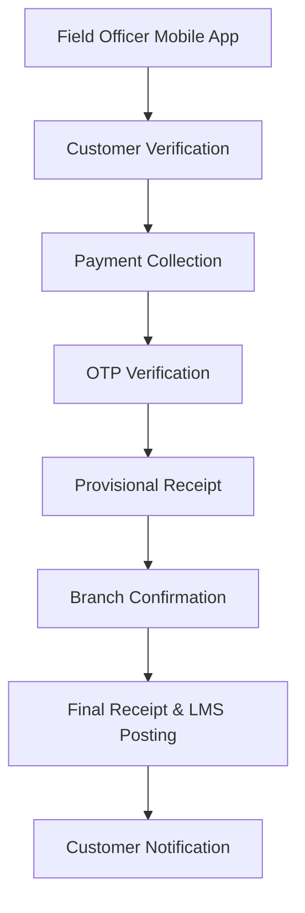
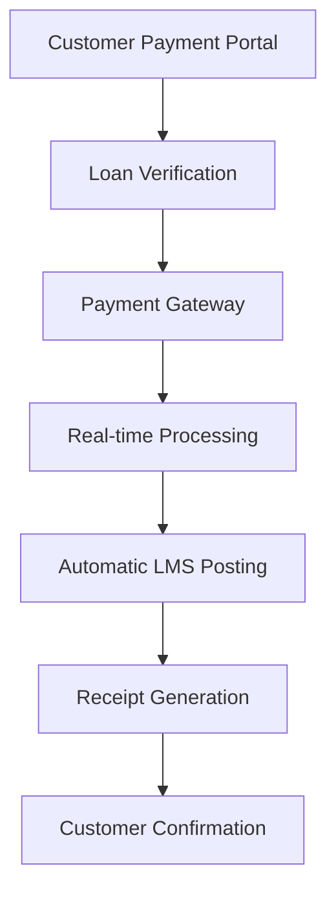
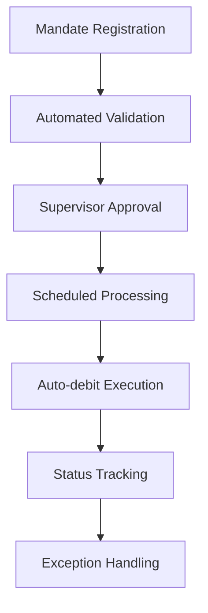

# BUSINESS REQUIREMENTS DOCUMENT

# FIVESTAR PAYMENTS ENGINE MODERNIZATION

&nbsp;&nbsp;&nbsp;&nbsp;&nbsp;&nbsp;&nbsp;&nbsp;&nbsp;&nbsp;

**Strategic Partnership Project**

---

## Document Information

| **Field** | **Details** |
|-----------|-------------|
| **Document Title** | Business Requirements Document |
| **Project Name** | Fivestar Payments Engine Modernization |
| **Client** | Fivestar Business Finance |
| **Prepared By** | 1CloudHub |
| **Document Version** | v1.0 |
| **Date** | May 16, 2025 |
| **Document Type** | Business Requirements |
| **Classification** | Confidential |

---

## ⚠️ DOCUMENT APPROVAL STATUS

**CURRENT STATUS:** 🔴 **PENDING FIVESTAR APPROVAL**

This document is currently in draft status and awaiting formal review and approval from Fivestar stakeholders. No implementation activities should proceed until proper approvals are received.

### Required Approvals
- **Business Review:** Azharuddin Nurul (Project Owner) - 🔴 **PENDING**
- **Technical Review:** Sridharan Vembu (Engineering Head) - 🔴 **PENDING**
- **Executive Sign-off:** Vanamali Sridharan (Executive Sponsor) - 🔴 **PENDING**

### 1CloudHub Internal Approvals
- **Solution Architect:** Preeth M - ✅ **APPROVED** (May 16, 2025)
- **Executive Sponsor:** Ramakrishna Phani - ✅ **APPROVED** (May 16, 2025)
- **Project Manager:** Vinod Ramanathan - ✅ **APPROVED** (May 16, 2025)

---

## Approval & Sign-off

| **Role** | **Name** | **Organization** | **Status** | **Date** |
|----------|----------|------------------|------------|----------|
| **Project Owner** | Azharuddin Nurul | Fivestar | 🔴 *Pending Review* | |
| **Engineering Head** | Sridharan Vembu | Fivestar | 🔴 *Pending Review* | |
| **Executive Sponsor** | Vanamali Sridharan | Fivestar | 🔴 *Pending Review* | |
| **Solution Architect** | Preeth M | 1CloudHub | ✅ *Approved* | May 16, 2025 |
| **Executive Sponsor** | Ramakrishna Phani | 1CloudHub | ✅ *Approved* | May 16, 2025 |
| **Project Manager** | Vinod Ramanathan | 1CloudHub | ✅ *Approved* | May 16, 2025 |

**Approval Status:**   
**GitHub Issue:** [Issue #1 - BRD Business Review](https://github.com/1cloudhub/fivestar-payments-engine/issues/1)  
**Sign-off Tracker:** [Link to tracker](../08_Customer_Approvals/SIGN_OFF_TRACKER.md)

---

## Revision History

| **Version** | **Date** | **Author** | **Changes** | **Approved By** |
|-------------|----------|------------|-------------|-----------------|
| v1.0 | May 16, 2025 | 1CloudHub Business Team | Initial version based on project requirements analysis | Azharuddin Nurul |

---

## Table of Contents

1. [Executive Summary](#1-executive-summary)
2. [Project Background](#2-project-background)
3. [Business Objectives](#3-business-objectives)
4. [Stakeholder Analysis](#4-stakeholder-analysis)
5. [Current State Assessment](#5-current-state-assessment)
6. [Business Requirements](#6-business-requirements)
7. [Business Process Flows](#7-business-process-flows)
8. [Business Rules](#8-business-rules)
9. [Success Criteria](#9-success-criteria)
10. [Assumptions and Constraints](#10-assumptions-and-constraints)
11. [Risk Assessment](#11-risk-assessment)
12. [Implementation Timeline](#12-implementation-timeline)
13. [Appendices](#13-appendices)

---

## 1. Executive Summary

### 1.1 Project Overview

Fivestar Business Finance has engaged 1CloudHub to modernize their Payments Engine, transitioning from a legacy monolithic system to a cloud-native microservices architecture deployed on AWS. This transformation aims to enhance operational efficiency, improve payment processing accuracy, support integration with multiple payment channels, and ensure scalability for future business growth.

### 1.2 Business Justification

The current payment functionality exists as a module within a legacy monolithic application that faces challenges including manual workflows, limited integration capabilities, and potential scaling constraints. The modernized Payments Engine will support various payment channels including cash collections, digital payments via RazorPay and BBPS, UPI AutoPay, and NACH mandates.

### 1.3 Scope Summary

This project will deliver a comprehensive payment processing platform built on modern technologies (.NET Core, React.js) deployed on AWS cloud infrastructure. Key features include secure authentication, role-based access control, efficient cash collection workflows, digital payment integration, automated mandate management, robust error handling, and comprehensive reporting capabilities.

### 1.4 Investment Summary

The implementation will follow a phased approach over 7-8 months to minimize business disruption, with parallel run capabilities to ensure uninterrupted operations.

---

## 2. Project Background

### 2.1 Business Context

Fivestar Business Finance is a leading Non-Banking Financial Company (NBFC) in India specializing in providing loans to underserved segments. Their primary focus is on Loan Against Property (LAP) under Business Finance, with an additional legacy portfolio of Home Loans (HL). As Fivestar continues to grow, the company faces increasing volumes of loan repayments through various channels, creating a need for a more efficient and scalable payment processing system.

### 2.2 Problem Statement

The existing payment engine operates as part of an ASP.NET Web Application (.NET Framework 4.6.1) with the following challenges:

1. **Cash Dominance**: A significant volume of payments is still handled in cash at branch locations, requiring multiple touchpoints and increasing the risk of manual errors or fraud.

2. **Fragmented Systems**: There is no centralized platform to initiate, monitor, or reconcile payments. Each payment mode (cash, cheque, UPI, NACH) follows a different workflow with limited integration.

3. **Manual Processes**: Many workflows rely on manual intervention, including field collection verification, cash handling, DCR/DBS preparation, and mandate registration.

4. **Limited Visibility**: Status tracking lacks real-time visibility, with branches relying on post-transaction confirmations or phone follow-ups with operations teams.

5. **Manual Reconciliation**: Reconciliation of payments with bank records and LMS entries is performed using Excel sheets, increasing workload and the risk of mismatches.

6. **Resilience Issues**: The system faces challenges during LMS downtime, leading to potential data loss or duplicate transactions.

### 2.3 Opportunity Description

This modernization project will enable:

- Streamlined payment operations across all channels
- Enhanced customer experience through digital payment options
- Improved operational efficiency through automation
- Better risk management through real-time monitoring
- Scalable infrastructure to support business growth

### 2.4 Strategic Alignment

This project aligns with Fivestar's digital transformation strategy and supports their goal of becoming a technology-forward NBFC capable of serving customers efficiently across diverse geographic and demographic segments.

---

## 3. Business Objectives

### 3.1 Primary Objectives

1. **Enhance Operational Efficiency**
   - Success Metric: 90% reduction in manual payment posting errors
   - Target: Achieve straight-through processing for 95% of digital payments

2. **Improve Customer Experience**
   - Success Metric: 30% increase in digital payment adoption
   - Target: 99% payment success rate across all channels

3. **Increase System Reliability**
   - Success Metric: 99.9% system availability
   - Target: Zero data loss during LMS downtime events

4. **Enable Business Scalability**
   - Success Metric: Support 3x growth in transaction volume
   - Target: Process 500,000+ transactions per month

5. **Strengthen Risk Management**
   - Success Metric: 100% transaction traceability
   - Target: Real-time fraud detection and prevention

### 3.2 Key Performance Indicators (KPIs)

| **KPI** | **Current State** | **Target State** | **Measurement Method** |
|---------|-------------------|------------------|------------------------|
| Payment Processing Time | 2-4 hours | < 1 hour | Average time from collection to LMS posting |
| Digital Payment Adoption | 20% | 50% | Percentage of non-cash payments |
| Reconciliation Accuracy | 85% | 99% | Percentage of automatically reconciled transactions |
| System Availability | 95% | 99.9% | Uptime monitoring |
| Customer Satisfaction | 70% | 90% | Customer feedback scores |
| Operational Cost per Transaction | ₹15 | ₹8 | Cost analysis |

---

## 4. Stakeholder Analysis

### 4.1 Primary Stakeholders

| **Stakeholder** | **Role** | **Responsibilities** | **Contact** |
|-----------------|----------|---------------------|-------------|
| Azharuddin Nurul | Product Owner | Requirement grooming, reviews, business validation | <azharuddin.nurul@fivestargroup.in> |
| Sridharan Vembu | Engineering Manager | Technical approval, final sign-off | <sridhar@fivestargroup.in> |
| Branch Operations Managers | Operations | Daily payment collection and reconciliation | [Regional contacts] |
| Finance Department | Finance | Financial reconciliation and reporting | [Finance team contacts] |

### 4.2 User Groups

#### 4.2.1 Field Officers

- **Current Challenge**: Manual processes, connectivity issues, delayed confirmations
- **Expected Benefit**: Mobile-optimized interface, offline capability, real-time sync
- **Success Criteria**: 50% reduction in collection time, 99% data accuracy

#### 4.2.2 Branch Cashiers

- **Current Challenge**: Manual reconciliation, paper-based workflows, limited visibility
- **Expected Benefit**: Automated workflows, real-time status, simplified DCR/DBS
- **Success Criteria**: 60% reduction in reconciliation time, 100% accuracy

#### 4.2.3 Finance Team

- **Current Challenge**: Manual interventions, duplicate transactions, LMS sync failures
- **Expected Benefit**: Exception management tools, automated reporting, audit capabilities
- **Success Criteria**: 80% reduction in manual interventions, 99% auto-reconciliation

#### 4.2.4 Customers

- **Current Challenge**: Limited payment options, delayed confirmations
- **Expected Benefit**: Multiple payment channels, instant receipts, payment history
- **Success Criteria**: 95% payment completion rate, 30% digital adoption

---

## 5. Current State Assessment

### 5.1 Current Business Processes

#### 5.1.1 Cash Collection Process

1. Field Officer visits customer location
2. Collects cash payment with manual verification
3. Returns to branch with physical cash
4. Branch Cashier manually reconciles and confirms
5. Data entry into Employee Portal
6. Manual LMS posting through MuleSoft APIs
7. Receipt generation and customer notification

#### 5.1.2 Digital Payment Process

1. Customer initiates payment through various channels
2. Payment processed by external gateway (RazorPay)
3. Manual verification and confirmation
4. Manual LMS posting with retry mechanisms
5. Reconciliation through Excel-based processes

#### 5.1.3 Mandate Management Process

1. Manual mandate registration and validation
2. Penny drop verification with manual oversight
3. Name matching with manual intervention for edge cases
4. Scheduled auto-debits with manual approval
5. Manual failure handling and retry processes

### 5.2 Current System Landscape

- **Core System**: ASP.NET Web Application (.NET Framework 4.6.1)
- **Integration**: MuleSoft API Gateway for LMS connectivity
- **Database**: SQL Server (legacy)
- **Payment Processors**: RazorPay, JusPay
- **Banking Partners**: RBL, KOTAK, SBI, IDFC, Yes Bank

### 5.3 Pain Points and Challenges

1. **Operational Inefficiency**
   - Impact: 40% of staff time spent on manual processes
   - Frequency: Daily operations

2. **Data Integrity Issues**
   - Impact: 10-15% reconciliation discrepancies
   - Frequency: Weekly reconciliation cycles

3. **Limited Scalability**
   - Impact: Performance degradation during peak periods
   - Frequency: Month-end processing

4. **Customer Experience Gaps**
   - Impact: Limited payment options, delayed confirmations
   - Frequency: Every customer interaction

---

## 6. Business Requirements

### 6.1 Functional Requirements

#### 6.1.1 Cash Collection Management

| **Requirement ID** | **Requirement Description** | **Priority** | **Acceptance Criteria** |
|-------------------|----------------------------|--------------|-------------------------|
| BR-CCM-001 | Support field collection via mobile app with OTP verification | Must Have | 100% of field collections verified via OTP |
| BR-CCM-002 | Enable branch cashier confirmation workflow | Must Have | All field collections require cashier confirmation |
| BR-CCM-003 | Generate provisional and final receipts | Must Have | Receipts generated within 30 seconds |
| BR-CCM-004 | Support denomination-wise cash entry | Should Have | Cashiers can record cash denominations |

#### 6.1.2 Digital Payment Processing

| **Requirement ID** | **Requirement Description** | **Priority** | **Acceptance Criteria** |
|-------------------|----------------------------|--------------|-------------------------|
| BR-DPP-001 | Integrate with RazorPay for web and mobile payments | Must Have | 99% payment success rate |
| BR-DPP-002 | Support QR code payments linked to loan accounts | Must Have | QR codes work with all UPI apps |
| BR-DPP-003 | Enable BBPS integration for government payment channel | Should Have | BBPS certification obtained |
| BR-DPP-004 | Automatic LMS posting with retry mechanisms | Must Have | 100% successful posting eventually |

#### 6.1.3 AutoPay Mandate Management

| **Requirement ID** | **Requirement Description** | **Priority** | **Acceptance Criteria** |
|-------------------|----------------------------|--------------|-------------------------|
| BR-AMM-001 | Support UPI AutoPay mandate registration via JusPay | Must Have | 95% registration success rate |
| BR-AMM-002 | Implement NACH mandate registration for multiple banks | Must Have | Support 5+ banking partners |
| BR-AMM-003 | Automated debit scheduling with advance notifications | Must Have | 72-hour advance notification |
| BR-AMM-004 | Fuzzy name matching with manual override capability | Must Have | 70% automated matching success |

### 6.2 Non-Functional Requirements

#### 6.2.1 Performance Requirements

- System response time < 2 seconds for 95% of transactions
- Support 1,000+ concurrent users
- Process 500,000+ transactions per month

#### 6.2.2 Security Requirements

- End-to-end encryption for all payment data
- Multi-factor authentication for privileged users
- Compliance with RBI and PCI DSS standards

#### 6.2.3 Availability Requirements

- 99.9% system availability
- Graceful degradation during partial outages
- Zero data loss during system failures

---

## 7. Business Process Flows

### 7.1 Future State Process Flows

#### 7.1.1 Enhanced Cash Collection Process

#### 7.1.2 Streamlined Digital Payment Process

#### 7.1.3 Automated Mandate Management

---

## 8. Business Rules

### 8.1 Core Business Rules

1. **Payment Allocation Priority**
   - Condition: Multiple outstanding amounts
   - Action: Allocate in order - penalties → interest → principal

2. **OTP Verification Mandate**
   - Condition: Field collection
   - Action: Must verify customer OTP before receipt generation

3. **72-Hour Advance Notification**
   - Condition: UPI auto-debit scheduled
   - Action: Send notification to customer 72 hours in advance

4. **Name Matching Threshold**
   - Condition: Mandate registration
   - Action: Require manual review if name match < 70%

### 8.2 Validation Rules

1. **Receipt Date Validation**: No future dates, within 2 days of current date
2. **Payment Amount Validation**: Cannot exceed outstanding loan amount
3. **Duplicate Prevention**: Unique transaction references across all channels
4. **Authorization Requirements**: Branch Manager approval for exceptions

---

## 9. Success Criteria

### 9.1 Business Success Metrics

| **Metric** | **Current Baseline** | **Target** | **Timeline** |
|------------|---------------------|------------|--------------|
| Payment Processing Efficiency | 4 hours average | 1 hour average | 6 months post go-live |
| Digital Payment Adoption | 20% | 50% | 12 months post go-live |
| Reconciliation Accuracy | 85% | 99% | 3 months post go-live |
| Customer Satisfaction Score | 3.5/5 | 4.5/5 | 6 months post go-live |
| Operational Cost Reduction | Baseline | 25% reduction | 12 months post go-live |

### 9.2 User Adoption Criteria

- 90% of field officers actively using mobile app within 3 months
- 95% of branch cashiers comfortable with new system within 2 months
- 80% customer adoption of digital payment options within 6 months

### 9.3 Operational Excellence Criteria

- 99.9% system availability
- Zero critical data loss incidents
- 100% regulatory compliance maintenance
- 95% SLA adherence for all integrations

---

## 10. Assumptions and Constraints

### 10.1 Business Assumptions

1. **User Adoption**: Staff will adapt to new technology with appropriate training
2. **Customer Behavior**: Customers will adopt digital payment options when available
3. **Regulatory Stability**: Current RBI regulations will remain stable during implementation
4. **Business Continuity**: Current operations will continue during transition period

### 10.2 Constraints

#### 10.2.1 Budget Constraints

- Project budget approved for 8-month timeline
- Operational budget for training and change management

#### 10.2.2 Timeline Constraints

- Go-live target by February 2026
- Parallel run period required for 2 months
- Seasonal constraints during peak collection periods

#### 10.2.3 Resource Constraints

- Limited availability of key business users during peak periods
- Dependency on third-party vendors for banking integrations
- Regulatory approval timelines for BBPS integration

#### 10.2.4 Technical Constraints

- Existing LMS system limitations
- MuleSoft integration layer dependencies
- Legacy data migration complexity

---

## 11. Risk Assessment

### 11.1 Business Risks

| **Risk ID** | **Risk Description** | **Probability** | **Impact** | **Mitigation Strategy** |
|-------------|---------------------|-----------------|------------|-------------------------|
| BR-R001 | User resistance to new system | Medium | High | Comprehensive training and change management |
| BR-R002 | Customer adoption slower than expected | Medium | Medium | Incentive programs and customer education |
| BR-R003 | Regulatory changes during implementation | Low | High | Regular compliance reviews and flexible design |
| BR-R004 | Business disruption during cutover | Medium | High | Phased rollout and parallel run strategy |

### 11.2 Operational Risks

- Integration delays with banking partners
- Data migration complexity
- Performance issues during peak periods
- Third-party vendor dependencies

### 11.3 Financial Risks

- Cost overruns due to scope changes
- Revenue impact during transition period
- Additional training and support costs
- Potential penalties for compliance gaps

---

## 12. Implementation Timeline

### 12.1 High-Level Milestones

| **Milestone** | **Description** | **Target Date** | **Dependencies** |
|---------------|-----------------|-----------------|------------------|
| Requirements Approval | All business requirements signed off | June 2025 | Stakeholder review complete |
| Design Completion | Technical design and architecture approved | August 2025 | Requirements approval |
| Development Complete | All modules developed and unit tested | November 2025 | Design approval |
| System Testing | Integration and system testing complete | December 2025 | Development complete |
| User Acceptance | Business users sign off on functionality | January 2026 | System testing complete |
| Go-Live | Production deployment and cutover | February 2026 | UAT sign-off |

### 12.2 Critical Path Items

- Banking partner API integrations
- LMS integration testing
- Data migration validation
- User training completion
- Regulatory approvals

### 12.3 Go-Live Criteria

- All critical functions tested and validated
- User training completed for all roles
- Data migration successful with validation
- Performance benchmarks met
- Regulatory compliance confirmed
- Rollback procedures tested and ready

---

## 13. Appendices

### 13.1 Glossary

| **Term** | **Definition** |
|----------|----------------|
| **DCR** | Daily Collection Reconciliation |
| **DBS** | Daily Balancing Statement |
| **LAP** | Loan Against Property |
| **LMS** | Loan Management System (FinnOne) |
| **NACH** | National Automated Clearing House |
| **UPI** | Unified Payments Interface |
| **UMRN** | Unique Mandate Reference Number |
| **BBPS** | Bharat Bill Payment System |
| **FO** | Field Officer |
| **OTP** | One-Time Password |

### 13.2 Reference Documents

1. Business Requirements Specification (BRS) v2.0 - Technical Requirements
2. Functional Requirements Specification (FRS) v2.0 - Detailed Functionality  
3. Software Requirements Specification (SRS) v3.0 - Complete System Specification
4. UX Design Brief v1.0 - User Experience Strategy
5. Style Guide v1.0 - Visual Design Standards

### 13.3 Stakeholder Interview Notes

#### Interview with Azharuddin Nurul (Product Owner) - May 10, 2025

- Emphasized need for mobile-first approach for field officers
- Stressed importance of maintaining business continuity during transition
- Highlighted customer experience improvements as key success factor

#### Interview with Branch Operations Team - May 12, 2025

- Identified pain points in current reconciliation process
- Requested simplified DCR/DBS workflow
- Emphasized need for reliable internet connectivity solutions

#### Interview with Finance Team - May 14, 2025

- Requested enhanced reporting and analytics capabilities
- Emphasized importance of audit trail and compliance
- Highlighted need for exception management tools

### 13.4 Market Research Data

- Digital payment adoption in Indian NBFC sector: 35% average
- Customer preference for UPI payments: 65% of urban, 40% of rural
- Mobile payment growth rate: 25% year-over-year
- Competitive analysis of similar implementations in NBFC sector

---

## Contact Information

### 1CloudHub Team

- **Executive Sponsor:** Ramakrishna Phani - <ramakrishna.phani@1cloudhub.com>
- **Project Manager:** Vinod Ramanathan - <vinod@1cloudhub.com>
- **Solution Architect:** Preeth M - <preeth.m@1cloudhub.com>

### Fivestar Team

- **Executive Sponsor:** Vanamali Sridharan - <vanamali@fivestargroup.in>
- **Project Owner:** Azharuddin Nurul - <azharuddin.nurul@fivestargroup.in>
- **Engineering Head:** Sridharan Vembu - <sridhar@fivestargroup.in>

---

**Document Classification:** Confidential  
**Distribution:** Limited to project stakeholders  
**Next Review Date:** July 16, 2025  
**Document Owner:** 1CloudHub Business Analysis Team

---

*This document contains confidential and proprietary information of 1CloudHub and Fivestar Business Finance. Any reproduction or distribution without written consent is prohibited.*
