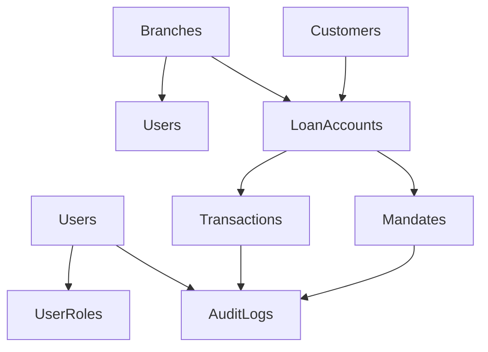

# DATA MIGRATION STRATEGY

# FIVESTAR – PAYMENTS ENGINE

**DATE:** 03-June-2025  
**Authored By:** 1CloudHub Technical Team  
**Version:** 1.0  
**Project:** Fivestar Payments Engine Modernization

---

## TABLE OF CONTENTS

1. [Executive Summary](#1-executive-summary)
2. [Migration Overview](#2-migration-overview)
3. [Source System Analysis](#3-source-system-analysis)
4. [Target Architecture](#4-target-architecture)
5. [Data Classification and Mapping](#5-data-classification-and-mapping)
6. [Migration Phases](#6-migration-phases)
7. [Technical Migration Approach](#7-technical-migration-approach)
8. [Data Validation and Testing](#8-data-validation-and-testing)
9. [Rollback Strategy](#9-rollback-strategy)
10. [Timeline and Resources](#10-timeline-and-resources)
11. [Risk Management](#11-risk-management)
12. [Success Criteria](#12-success-criteria)
13. [Appendices](#13-appendices)

---

## 1. Executive Summary

The Fivestar Payments Engine modernization requires a comprehensive data migration from legacy systems to a modern cloud-native architecture utilizing both PostgreSQL and DynamoDB databases. This strategy document outlines the approach for migrating critical business data while ensuring zero data loss, minimal downtime, and business continuity.

### 1.1 Key Migration Objectives

- **Zero Data Loss**: Ensure 100% data integrity during migration
- **Minimal Downtime**: Target maximum 4-hour downtime for critical systems
- **Business Continuity**: Maintain payment processing capabilities throughout migration
- **Performance Optimization**: Improve data access patterns in target architecture
- **Compliance Maintenance**: Ensure regulatory compliance throughout migration process

### 1.2 Migration Scope

| Component | Source System | Target System | Data Volume | Priority |
|-----------|---------------|---------------|-------------|----------|
| User Management | Legacy SQL Server | PostgreSQL | ~500 records | High |
| Master Data | Legacy SQL Server | PostgreSQL | ~10K records | High |
| Transaction History | Legacy SQL Server | DynamoDB | ~5M records | Medium |
| Configuration Data | Legacy SQL Server | PostgreSQL | ~200 records | High |
| Audit Logs | Legacy SQL Server | DynamoDB | ~10M records | Low |

---

## 2. Migration Overview

### 2.1 Current State Architecture

```
┌─────────────────────────────────────────────────────────┐
│                 LEGACY SYSTEM                           │
├─────────────────────────────────────────────────────────┤
│  ASP.NET Web Application (.NET Framework 4.6.1)       │
│                                                         │
│  ┌─────────────────┐  ┌─────────────────┐              │
│  │   SQL Server    │  │   File System   │              │
│  │   (On-Premise)  │  │   Documents     │              │
│  │                 │  │   Reports       │              │
│  │ • User Data     │  │                 │              │
│  │ • Transactions  │  └─────────────────┘              │
│  │ • Config Data   │                                    │
│  │ • Audit Logs    │                                    │
│  └─────────────────┘                                    │
└─────────────────────────────────────────────────────────┘
```

### 2.2 Target State Architecture

```
┌─────────────────────────────────────────────────────────┐
│                 AWS CLOUD ARCHITECTURE                  │
├─────────────────────────────────────────────────────────┤
│                                                         │
│  ┌─────────────────┐  ┌─────────────────┐              │
│  │   PostgreSQL    │  │   DynamoDB      │              │
│  │   (RDS)         │  │   (NoSQL)       │              │
│  │                 │  │                 │              │
│  │ • Users/Roles   │  │ • Transactions  │              │
│  │ • Master Data   │  │ • Queue Data    │              │
│  │ • Config Data   │  │ • Session Data  │              │
│  │ • Reports       │  │ • Audit Logs    │              │
│  │ • Mandates      │  │ • Deduplication │              │
│  └─────────────────┘  └─────────────────┘              │
│                                                         │
│  ┌─────────────────┐                                    │
│  │   Amazon S3     │                                    │
│  │   (Documents)   │                                    │
│  │                 │                                    │
│  │ • Receipts      │                                    │
│  │ • Reports       │                                    │
│  │ • Backups       │                                    │
│  └─────────────────┘                                    │
└─────────────────────────────────────────────────────────┘
```

### 2.3 Migration Principles

1. **Data-First Approach**: Migrate data before application logic
2. **Incremental Migration**: Phase-wise migration to minimize risk
3. **Parallel Validation**: Continuous validation during migration
4. **Rollback Readiness**: Maintain ability to rollback at each phase
5. **Business Continuity**: Ensure payments continue during migration

---

## 3. Source System Analysis

### 3.1 Legacy Database Schema Analysis

#### 3.1.1 Database Inventory

| Database | Purpose | Size (GB) | Table Count | Record Count |
|----------|---------|-----------|-------------|--------------|
| FivestarProd | Main application database | 250 | 85 | 15M |
| FivestarConfig | Configuration and lookup data | 5 | 20 | 10K |
| FivestarAudit | Audit and logging data | 500 | 15 | 50M |
| FivestarReports | Reporting and analytics | 100 | 30 | 5M |

#### 3.1.2 Critical Tables Mapping

| Legacy Table | Purpose | Record Count | Target Database | Target Structure |
|--------------|---------|--------------|-----------------|------------------|
| Users | User management | 500 | PostgreSQL | Enhanced schema with RBAC |
| Branches | Branch master data | 150 | PostgreSQL | Normalized structure |
| Customers | Customer information | 100K | PostgreSQL | Enhanced customer schema |
| LoanAccounts | Loan account details | 80K | PostgreSQL | Optimized for reporting |
| Transactions | Payment transactions | 5M | DynamoDB | JSON document structure |
| CashReceipts | Cash collection records | 2M | DynamoDB | Unified transaction format |
| Mandates | UPI/NACH mandates | 50K | PostgreSQL | Workflow-enabled schema |
| SystemConfig | Configuration parameters | 200 | PostgreSQL | Environment-specific config |
| AuditLogs | System audit trails | 10M | DynamoDB | Time-series optimized |

### 3.2 Data Quality Assessment

#### 3.2.1 Data Quality Issues Identified

| Issue Type | Description | Impact | Remediation |
|------------|-------------|--------|-------------|
| Missing Foreign Keys | Orphaned records in child tables | Medium | Clean up orphaned records |
| Inconsistent Formats | Phone numbers, dates in multiple formats | Medium | Standardize during migration |
| Duplicate Records | Customer duplicates due to data entry | High | Implement deduplication logic |
| NULL Values | Critical fields with NULL values | High | Apply business rules for defaults |
| Data Type Mismatches | Numeric data stored as strings | Low | Convert during migration |

#### 3.2.2 Data Cleansing Requirements

```sql
-- Example: Customer data cleansing
WITH duplicate_customers AS (
    SELECT customer_name, phone_number, COUNT(*) as count
    FROM customers 
    GROUP BY customer_name, phone_number 
    HAVING COUNT(*) > 1
)
-- Deduplication logic to be applied during migration
```

### 3.3 Data Dependencies

#### 3.3.1 Inter-table Dependencies



#### 3.3.2 External System Dependencies

| External System | Dependency Type | Impact on Migration |
|-----------------|----------------|-------------------|
| LMS (FinnOne) | Real-time integration | Parallel operation required |
| DarwinBox HRMS | User authentication | User data sync needed |
| Banking Partners | Mandate validation | Historical data reconciliation |
| RazorPay | Payment processing | Transaction history mapping |

---

## 4. Target Architecture

### 4.1 Database Distribution Strategy

#### 4.1.1 PostgreSQL (Relational Data)

**Purpose**: Master data, configuration, complex relationships, reporting

| Data Category | Tables | Rationale |
|---------------|--------|-----------|
| User Management | users, roles, permissions, user_sessions | Complex RBAC requirements |
| Master Data | branches, customers, loan_accounts, products | Referential integrity needs |
| Configuration | system_config, lookup_values, business_rules | ACID compliance required |
| Mandate Management | payment_mandates, mandate_executions | Approval workflows |
| Reconciliation | dcr_records, dbs_records, reconciliation_summary | Financial calculations |

#### 4.1.2 DynamoDB (High-Volume Transactional Data)

**Purpose**: High-volume transactions, real-time processing, session management

| Data Category | Tables | Rationale |
|---------------|--------|-----------|
| Transactions | payment_transactions | High write volume, real-time processing |
| Queue Management | transaction_queue, retry_queue | LMS downtime handling |
| Session Data | user_sessions, temp_data | Fast read/write, auto-expiration |
| Audit Logs | audit_events, security_logs | High volume, time-series data |
| Deduplication | transaction_hashes | Fast lookups, auto-cleanup |

### 4.2 Data Model Transformation

#### 4.2.1 PostgreSQL Schema Design

```sql
-- Enhanced User Management Schema
CREATE TABLE users (
    user_id UUID PRIMARY KEY DEFAULT gen_random_uuid(),
    username VARCHAR(100) UNIQUE NOT NULL,
    email VARCHAR(255) NOT NULL,
    darwinbox_id VARCHAR(100) UNIQUE,
    gcp_sam_account VARCHAR(100),
    role_id UUID REFERENCES roles(role_id),
    branch_code VARCHAR(20) REFERENCES branches(branch_code),
    is_active BOOLEAN DEFAULT true,
    mfa_enabled BOOLEAN DEFAULT false,
    last_login_at TIMESTAMP,
    created_at TIMESTAMP DEFAULT NOW(),
    updated_at TIMESTAMP DEFAULT NOW()
);

-- Enhanced Loan Account Schema
CREATE TABLE loan_accounts (
    loan_account_id UUID PRIMARY KEY DEFAULT gen_random_uuid(),
    loan_account_number VARCHAR(50) UNIQUE NOT NULL,
    customer_id UUID REFERENCES customers(customer_id),
    product_id UUID REFERENCES loan_products(product_id),
    branch_code VARCHAR(20) REFERENCES branches(branch_code),
    principal_amount DECIMAL(15,2) NOT NULL,
    outstanding_amount DECIMAL(15,2) NOT NULL,
    emi_amount DECIMAL(15,2),
    next_due_date DATE,
    loan_status VARCHAR(20) DEFAULT 'active',
    created_at TIMESTAMP DEFAULT NOW(),
    updated_at TIMESTAMP DEFAULT NOW()
);
```

#### 4.2.2 DynamoDB Schema Design

```json
{
  "TableName": "PaymentTransactions",
  "AttributeDefinitions": [
    {"AttributeName": "transaction_id", "AttributeType": "S"},
    {"AttributeName": "loan_account_number", "AttributeType": "S"},
    {"AttributeName": "transaction_date", "AttributeType": "S"},
    {"AttributeName": "channel", "AttributeType": "S"}
  ],
  "KeySchema": [
    {"AttributeName": "transaction_id", "KeyType": "HASH"}
  ],
  "GlobalSecondaryIndexes": [
    {
      "IndexName": "LoanAccountIndex",
      "KeySchema": [
        {"AttributeName": "loan_account_number", "KeyType": "HASH"},
        {"AttributeName": "transaction_date", "KeyType": "RANGE"}
      ]
    },
    {
      "IndexName": "ChannelDateIndex",
      "KeySchema": [
        {"AttributeName": "channel", "KeyType": "HASH"},
        {"AttributeName": "transaction_date", "KeyType": "RANGE"}
      ]
    }
  ]
}
```

---

## 5. Data Classification and Mapping

### 5.1 Data Classification Matrix

| Data Type | Sensitivity | Volume | Frequency | Target DB | Migration Priority |
|-----------|-------------|--------|-----------|-----------|-------------------|
| User Credentials | High | Low | Low | PostgreSQL | Phase 1 |
| Customer PII | High | Medium | Low | PostgreSQL | Phase 1 |
| Financial Transactions | High | High | High | DynamoDB | Phase 2 |
| System Configuration | Medium | Low | Low | PostgreSQL | Phase 1 |
| Audit Logs | Medium | High | High | DynamoDB | Phase 3 |
| Session Data | Low | Medium | High | DynamoDB | Phase 2 |

### 5.2 Visual Schema Migration Map

The following diagram illustrates the comprehensive transformation from 104 legacy tables to 28 optimized tables in the modern architecture:

```mermaid
flowchart LR
    %% Legacy System (Left Side)
    subgraph LEGACY["🗄️ LEGACY SYSTEM (104 Tables)"]
        direction TB
        
        %% Cash Management Tables
        subgraph CASH_LEG["💰 Cash Management (10 tables)"]
            TBL_DBS["Tbl_DBS"]
            TBL_CASH_REC["Tbl_CashReceipts"]
            TBL_CASH_BAL["Tbl_CashBalance"]
            TBL_PETTY["Tbl_PettyCash"]
            TBL_LEGAL["Tbl_LegalFees_New"]
            RECEIPT_ENTRY["ReceiptEntry_Approval"]
            TBL_PRINT["Tbl_PrintReceipts"]
            RECEIPT_SMS["ReceiptSMSLog"]
            TBL_FIELD["Tbl_CashReceipts_Field"]
            EP_RECEIPT["EP_RECEIPT_DSB"]
        end
        
        %% UPI Digital Payments
        subgraph UPI_LEG["📱 UPI/Digital Payments (6 tables)"]
            UPI_MANDATE["UPI_JMANDATEREGISTRATION"]
            UPI_FUZZY["UPI_JFuzzyNamedetails"]
            UPI_SAVE["UPI_JMandateSavedetails"]
            UPI_LOGS["UPI_JMandateLogsWeb"]
            UPI_CALLBACK["UPI_JUPDATEMANDATECALLBACK"]
            IDFC_PAY["IDFCPaymentTransactionRequest"]
        end
        
        %% NACH Mandates
        subgraph NACH_LEG["🏦 NACH Mandates (17 tables)"]
            NACH_CLIENTS["NachClients_New"]
            CLIENT_BANK["ClientBankDetails_New"]
            NACH_REG["Nach_RegistrationResponseFile"]
            NACH_PRES["Nach_RBLPresentationFile"]
            NACH_CLEAR["Nach_ClearanceFile"]
            NACH_EMI["Nach_EMIDetails"]
            PENNY_DROP["PennyDrop"]
            ENACH_CALLBACK["ENACH_MandateStatusCallBack"]
            NACH_SMS["Nach_SmsNotification"]
        end
        
        %% BBPS Integration
        subgraph BBPS_LEG["🌐 BBPS Integration (13 tables)"]
            BBPS_PAY["BBPS_PAYMENTDETAILS"]
            BBPS_QUEUE["BBPS_POSTQUEREPUBTRACK"]
            BBPS_EXCEPT["BBPS_APIEXCEPTION_LOG"]
            BBPS_RECEIPT["BBPS_RECEIPTS"]
            BBPS_SUB["BBPS_SUBSCRIBERREQUEST"]
            BBPS_SEQ["BBPS_TRANS_SEQUENCER"]
            BBPS_DUE["BBPS_DUECHECK"]
            BBPS_RETRY["BBPS_PREQUEREPUBTRACK"]
        end
        
        %% User Management
        subgraph USER_LEG["👥 User Management (7 tables)"]
            USER_MASTER["UserMaster"]
            BRANCH_MASTER["BranchMaster"]
            USER_BRANCH["UserBranchStateMap_Tbl"]
            EMP_IDENTITY["EmpIdentityCard"]
            EMP_REQ["EmployeeRequests"]
            CODE_VALUES["CodeValues"]
            STATE_MASTER["StateMaster"]
        end
        
        %% Master Data
        subgraph MASTER_LEG["📋 Configuration & Master (6 tables)"]
            GENERIC_PARAM["GENERIC_PARAMETER"]
            GENERIC_LOOKUP["GENERIC_LOOKUP"]
            ORG_MASTER["ORG_MASTER"]
            SMS_TEMPLATE["SMSTemplate"]
            KOTAK_MAPPING["Kotak_NPCI_BankName_Mapping"]
            DATE_SEQ["DATESEQUENCE"]
        end
        
        %% LMS Integration
        subgraph LMS_LEG["🔗 LMS Integration (10 tables)"]
            LMS_LOAN["LMS_LOANACCOUNT_DTL"]
            LMS_RECEIPT["LMS_RECEIPTPAYMENT_DTL"]
            ERP_LOAN["Erp_LoanDetails"]
            ERP_CUST["Erp_Customers_New"]
            LMS_SCHEDULE["LMS_REPAYSCHEDULE_DTL"]
            APPLICATION["Application"]
            CUSTOMER["Customer"]
            CO_BORROWERS["CO_BORROWERS"]
            LOAN_DETAILS["Loan Details"]
            BRANCHES_LMS["Branches"]
        end
        
        %% Audit & Logging
        subgraph AUDIT_LEG["📝 Audit & Logging (15 tables)"]
            SMS_LOG["SMSLog"]
            RECEIPT_SMS_RECORDS["RECEIPT_SMS_LOG_RECORDS"]
            LOG_PENNY["LOG_IDFC_PENNYDROP_API"]
            DR_LOGIN["DR_SPL_LOGIN"]
            DR_TIME["DR_SPL_TIME"]
            DR_DATE["DR_SPL_ENTRY_DATE"]
            CHECK_IN["CheckInStatus"]
            CHECK_COUNT["CheckInCount"]
        end
        
        %% Other Legacy Tables
        subgraph OTHER_LEG["🔧 Other Legacy (20 tables)"]
            VOUCHER_DTL["Voucher Details"]
            INSTALLMENT["Installment Payment details"]
            TENANT["NEO_CAS_LMS_FSPROD.TENANT"]
            DEMAND["D1C1_Open_Demand"]
            INSURANCE["Insurance Nach Details"]
            LOAN_BRANCH["Loan_branch_new"]
        end
    end
    
    %% Modern System (Right Side)
    subgraph MODERN["🚀 OPTIMIZED MODERN SYSTEM (28 Tables)"]
        direction TB
        
        %% PostgreSQL Database
        subgraph POSTGRES["🐘 PostgreSQL (18 Tables)"]
            direction TB
            
            subgraph CORE_ENTITIES["🎯 Core Business Entities (6 tables)"]
                CUSTOMERS_NEW["👥 customers<br/>Customer master data"]
                LOAN_ACCOUNTS_NEW["💳 loan_accounts<br/>Loan master with balances"]
                BRANCHES_NEW["🏢 branches<br/>Branch master"]
                USERS_NEW["👤 users<br/>User accounts"]
                CO_BORROWERS_NEW["👫 co_borrowers<br/>Co-borrower relationships"]
                STATES_NEW["🗺️ states<br/>State/location reference"]
            end
            
            subgraph UNIFIED_CONFIG["⚙️ Unified Configuration (1 table)"]
                SYSTEM_CONFIG["⚙️ system_configuration<br/>All system/business config"]
            end
            
            subgraph UNIFIED_AUTH["🔐 Unified Authorization (3 tables)"]
                ROLES_NEW["🎭 roles<br/>System roles"]
                PERMISSIONS_NEW["🔑 permissions<br/>Granular permissions"]
                USER_ROLE_PERM["🗺️ user_role_permissions<br/>User-role-permission mapping"]
            end
            
            subgraph UNIFIED_MANDATES["🏦 Unified Mandates (2 tables)"]
                PAYMENT_MANDATES["💳 payment_mandates<br/>UPI + NACH mandates unified"]
                MANDATE_SCHEDULE["📅 mandate_execution_schedule<br/>Unified scheduling"]
            end
            
            subgraph CASH_MGMT["💰 Cash Management (3 tables)"]
                CASH_COLLECTIONS["💵 cash_collections<br/>All cash collection types"]
                DAILY_RECON["📊 daily_reconciliation<br/>DCR/DBS unified"]
                GENERIC_APPROVALS["✅ generic_approvals<br/>Unified approval workflow"]
            end
            
            subgraph REFERENCE_DATA["📋 Reference Data (3 tables)"]
                LOOKUP_VALUES["📖 lookup_values<br/>All reference data"]
                BANKING_PARTNERS["🏦 banking_partners<br/>Partner configuration"]
                INTEGRATION_ENDPOINTS["🔌 integration_endpoints<br/>API endpoint management"]
            end
        end
        
        %% DynamoDB Database
        subgraph DYNAMO["⚡ DynamoDB (10 Tables)"]
            direction TB
            
            subgraph UNIFIED_TRANSACTIONS["💳 Unified Transaction Processing (3 tables)"]
                TRANSACTIONS_UNIFIED["💳 Transactions<br/>All payment channels unified"]
                PROCESSING_QUEUE["🔄 ProcessingQueue<br/>All retry queues unified"]
                AUDIT_EVENTS["📋 AuditEvents<br/>All audit logs unified"]
            end
            
            subgraph SESSION_TEMP["⏱️ Session & Temporary (3 tables)"]
                USER_SESSIONS_UNI["👤 UserSessions<br/>All session types"]
                TEMPORARY_DATA["⏰ TemporaryData<br/>OTP, cache, calculations"]
                NOTIFICATION_DELIVERY["📢 NotificationDelivery<br/>SMS, email, push unified"]
            end
            
            subgraph REALTIME_PROC["⚡ Real-time Processing (4 tables)"]
                MANDATE_EXECUTIONS["🏦 MandateExecutions<br/>Real-time execution logs"]
                PAYMENT_CALLBACKS["🔄 PaymentCallbacks<br/>Webhook processing"]
                REALTIME_METRICS["📊 RealTimeMetrics<br/>Performance monitoring"]
                FILE_PROCESSING["📁 FileProcessing<br/>Banking file operations"]
            end
        end
    end
    
    %% Migration Arrows - Cash Management
    TBL_DBS --> DAILY_RECON
    TBL_CASH_REC --> CASH_COLLECTIONS
    TBL_CASH_REC --> TRANSACTIONS_UNIFIED
    TBL_CASH_BAL --> CASH_COLLECTIONS
    TBL_PETTY --> CASH_COLLECTIONS
    TBL_LEGAL --> CASH_COLLECTIONS
    RECEIPT_ENTRY --> GENERIC_APPROVALS
    TBL_PRINT --> AUDIT_EVENTS
    RECEIPT_SMS --> NOTIFICATION_DELIVERY
    TBL_FIELD --> TRANSACTIONS_UNIFIED
    EP_RECEIPT --> TRANSACTIONS_UNIFIED
    
    %% Migration Arrows - UPI
    UPI_MANDATE --> PAYMENT_MANDATES
    UPI_FUZZY --> SYSTEM_CONFIG
    UPI_SAVE --> PAYMENT_MANDATES
    UPI_LOGS --> TRANSACTIONS_UNIFIED
    UPI_CALLBACK --> PAYMENT_CALLBACKS
    IDFC_PAY --> TRANSACTIONS_UNIFIED
    
    %% Migration Arrows - NACH
    NACH_CLIENTS --> PAYMENT_MANDATES
    CLIENT_BANK --> PAYMENT_MANDATES
    NACH_REG --> MANDATE_SCHEDULE
    NACH_PRES --> FILE_PROCESSING
    NACH_CLEAR --> FILE_PROCESSING
    NACH_EMI --> MANDATE_SCHEDULE
    PENNY_DROP --> AUDIT_EVENTS
    ENACH_CALLBACK --> PAYMENT_CALLBACKS
    NACH_SMS --> NOTIFICATION_DELIVERY
    
    %% Migration Arrows - BBPS
    BBPS_PAY --> TRANSACTIONS_UNIFIED
    BBPS_QUEUE --> PROCESSING_QUEUE
    BBPS_EXCEPT --> AUDIT_EVENTS
    BBPS_RECEIPT --> TRANSACTIONS_UNIFIED
    BBPS_SUB --> TRANSACTIONS_UNIFIED
    BBPS_SEQ --> TRANSACTIONS_UNIFIED
    BBPS_DUE --> TRANSACTIONS_UNIFIED
    BBPS_RETRY --> PROCESSING_QUEUE
    
    %% Migration Arrows - User Management
    USER_MASTER --> USERS_NEW
    BRANCH_MASTER --> BRANCHES_NEW
    USER_BRANCH --> USER_ROLE_PERM
    EMP_IDENTITY --> USERS_NEW
    EMP_REQ --> AUDIT_EVENTS
    CODE_VALUES --> LOOKUP_VALUES
    STATE_MASTER --> STATES_NEW
    
    %% Migration Arrows - Master Data
    GENERIC_PARAM --> SYSTEM_CONFIG
    GENERIC_LOOKUP --> LOOKUP_VALUES
    ORG_MASTER --> SYSTEM_CONFIG
    SMS_TEMPLATE --> SYSTEM_CONFIG
    KOTAK_MAPPING --> BANKING_PARTNERS
    DATE_SEQ --> SYSTEM_CONFIG
    
    %% Migration Arrows - LMS Integration
    LMS_LOAN --> LOAN_ACCOUNTS_NEW
    LMS_RECEIPT --> TRANSACTIONS_UNIFIED
    ERP_LOAN --> LOAN_ACCOUNTS_NEW
    ERP_CUST --> CUSTOMERS_NEW
    LMS_SCHEDULE --> MANDATE_SCHEDULE
    APPLICATION --> LOAN_ACCOUNTS_NEW
    CUSTOMER --> CUSTOMERS_NEW
    CO_BORROWERS --> CO_BORROWERS_NEW
    LOAN_DETAILS --> LOAN_ACCOUNTS_NEW
    BRANCHES_LMS --> BRANCHES_NEW
    
    %% Migration Arrows - Audit & Logging
    SMS_LOG --> NOTIFICATION_DELIVERY
    RECEIPT_SMS_RECORDS --> NOTIFICATION_DELIVERY
    LOG_PENNY --> AUDIT_EVENTS
    DR_LOGIN --> AUDIT_EVENTS
    DR_TIME --> AUDIT_EVENTS
    DR_DATE --> AUDIT_EVENTS
    CHECK_IN --> AUDIT_EVENTS
    CHECK_COUNT --> AUDIT_EVENTS
    
    %% Migration Arrows - Other Legacy
    VOUCHER_DTL --> TRANSACTIONS_UNIFIED
    INSTALLMENT --> TRANSACTIONS_UNIFIED
    TENANT --> SYSTEM_CONFIG
    DEMAND --> LOAN_ACCOUNTS_NEW
    INSURANCE --> PAYMENT_MANDATES
    LOAN_BRANCH --> BRANCHES_NEW
```



#### 5.2.1 Migration Benefits Analysis

This comprehensive schema transformation achieves significant improvements:

| Metric | Legacy System | Modern System | Improvement |
|--------|---------------|---------------|-------------|
| **Total Tables** | 104 tables | 28 tables | **73% reduction** |
| **Cash Management** | 10 fragmented tables | 3 unified tables | **70% reduction** |
| **UPI/Digital Payments** | 6 specialized tables | 2 unified tables | **67% reduction** |
| **NACH Mandates** | 17 complex tables | 2 unified tables | **88% reduction** |
| **BBPS Integration** | 13 separate tables | 3 unified tables | **77% reduction** |
| **User Management** | 7 tables | 6 optimized tables | **14% reduction** |
| **Configuration** | 6 scattered tables | 1 unified table | **83% reduction** |
| **Audit & Logging** | 15 fragmented tables | 3 unified tables | **80% reduction** |

#### 5.2.2 Key Optimization Strategies

**1. Channel Unification**

- All payment channels (Cash, RazorPay, QR, BBPS, UPI, NACH) consolidated into unified transaction tables
- Single processing queue for all retry mechanisms
- Unified audit trail across all channels

**2. Database Technology Optimization**

- **PostgreSQL**: Complex relationships, master data, configuration
- **DynamoDB**: High-volume transactions, real-time processing, session management

**3. Business Logic Consolidation**

- Unified mandate management for both UPI and NACH
- Single approval workflow for all business processes
- Consolidated notification delivery system

**4. Performance Enhancements**

- Reduced JOIN complexity through denormalization where appropriate
- Optimized indexing strategy for reporting queries
- Separated transactional and analytical workloads

### 5.3 Field-Level Mapping

#### 5.3.1 User Data Mapping

| Legacy Field | Legacy Type | Target Field | Target Type | Transformation |
|--------------|-------------|--------------|-------------|----------------|
| UserID | int | user_id | UUID | Generate new UUID |
| Username | varchar(50) | username | varchar(100) | Direct mapping |
| EmailID | varchar(100) | email | varchar(255) | Validate format |
| RoleID | int | role_id | UUID | Map to new role system |
| BranchCode | varchar(10) | branch_code | varchar(20) | Direct mapping |
| IsActive | bit | is_active | boolean | Convert bit to boolean |
| CreatedDate | datetime | created_at | timestamp | Convert to UTC |

#### 5.3.2 Transaction Data Mapping

| Legacy Field | Legacy Type | Target Field | Target Type | Transformation |
|--------------|-------------|--------------|-------------|----------------|
| TransactionID | varchar(50) | transaction_id | string | Add channel prefix |
| LoanAccountNo | varchar(20) | loan_account_number | string | Direct mapping |
| Amount | decimal(15,2) | amount | number | Direct mapping |
| TransactionDate | datetime | transaction_date | string (ISO) | Convert to ISO format |
| PaymentMode | varchar(20) | channel | string | Map to new channel codes |
| Status | varchar(20) | status | string | Standardize status values |
| ReceiptNo | varchar(50) | receipt_number | string | Direct mapping |

### 5.4 Data Transformation Rules

#### 5.4.1 Business Rules for Data Transformation

1. **Channel Mapping**:
   - Cash → 'CASH'
   - Online → 'RAZORPAY_WEB' (W- prefix)
   - Mobile → 'RAZORPAY_MOBILE' (M- prefix)
   - QR Code → 'QR_CODE' (Q- prefix)
   - BBPS → 'BBPS' (B- prefix)

2. **Status Standardization**:
   - 'Success' → 'COMPLETED'
   - 'Failed' → 'FAILED'
   - 'Pending' → 'PENDING'
   - 'Cancelled' → 'CANCELLED'

3. **Date Format Standardization**:
   - All dates converted to ISO 8601 format (UTC)
   - Null dates converted to appropriate defaults

---

## 6. Migration Phases

### 6.1 Phase 1: Foundation and Master Data (Weeks 1-2)

#### 6.1.1 Scope

- User management data
- Branch and organizational hierarchy
- System configuration
- Lookup values and constants

#### 6.1.2 Activities

```yaml
Week 1:
  Day 1-2: Environment setup and validation
  Day 3-4: Schema creation and validation
  Day 5-7: User and role data migration

Week 2:
  Day 1-3: Master data migration (branches, products, customers)
  Day 4-5: Configuration data migration
  Day 6-7: Data validation and testing
```

#### 6.1.3 Success Criteria

- 100% user accounts migrated with correct role assignments
- All master data relationships validated
- Configuration parameters verified
- Zero data loss confirmed

### 6.2 Phase 2: Transactional Data (Weeks 3-4)

#### 6.2.1 Scope

- Historical payment transactions (last 12 months)
- Active mandate information
- Session and temporary data structures

#### 6.2.2 Migration Strategy

```yaml
Batch Size: 50,000 records per batch
Parallel Processing: 4 concurrent threads
Validation: Real-time during migration
Rollback: Point-in-time snapshots

Timeline:
  Week 3: Transaction history migration
  Week 4: Mandate data and validation
```

#### 6.2.3 Performance Targets

- Migration speed: 100,000 transactions/hour
- Data validation: Real-time
- Downtime: Maximum 2 hours for this phase

### 6.3 Phase 3: Audit and Archival Data (Weeks 5-6)

#### 6.3.1 Scope

- Historical audit logs
- Archived transaction data (>12 months)
- Backup and recovery validation

#### 6.3.2 Migration Approach

```yaml
Priority: Low (can run in background)
Method: Batch processing during off-hours
Validation: Sample-based verification
Completion: Not blocking for go-live
```

### 6.4 Phase 4: Cutover and Validation (Week 7)

#### 6.4.1 Activities

- Final data synchronization
- Application cutover
- End-to-end testing
- Performance validation
- Go-live preparation

#### 6.4.2 Cutover Window

```yaml
Duration: 4 hours maximum
Schedule: Saturday 11 PM - Sunday 3 AM
Rollback Point: Saturday 10 PM backup
Go/No-Go Decision: Saturday 10:30 PM
```

---

## 7. Technical Migration Approach

### 7.1 Migration Tools and Technologies

#### 7.1.1 AWS Database Migration Service (DMS)

```yaml
Configuration:
  Source: SQL Server (On-premise)
  Target: PostgreSQL (RDS)
  Instance Type: dms.r5.2xlarge
  Multi-AZ: Yes
  CDC: Enabled for continuous replication

Migration Tasks:
  - Full Load: Initial data migration
  - CDC: Ongoing change capture
  - Validation: Built-in data validation
```

#### 7.1.2 Custom Migration Scripts

```python
# Example: DynamoDB migration script
import boto3
import pyodbc
from datetime import datetime
import json

class TransactionMigrator:
    def __init__(self):
        self.dynamodb = boto3.resource('dynamodb')
        self.table = self.dynamodb.Table('PaymentTransactions')
        self.sql_conn = pyodbc.connect(CONNECTION_STRING)
    
    def migrate_transactions(self, batch_size=1000):
        cursor = self.sql_conn.cursor()
        cursor.execute("""
            SELECT TransactionID, LoanAccountNo, Amount, 
                   TransactionDate, PaymentMode, Status
            FROM Transactions 
            WHERE TransactionDate >= ?
        """, datetime.now() - timedelta(days=365))
        
        batch = []
        for row in cursor:
            item = self.transform_transaction(row)
            batch.append(item)
            
            if len(batch) >= batch_size:
                self.write_batch(batch)
                batch = []
        
        if batch:
            self.write_batch(batch)
    
    def transform_transaction(self, row):
        return {
            'transaction_id': f"{self.get_channel_prefix(row.PaymentMode)}-{row.TransactionID}",
            'loan_account_number': row.LoanAccountNo,
            'amount': float(row.Amount),
            'transaction_date': row.TransactionDate.isoformat(),
            'channel': self.map_channel(row.PaymentMode),
            'status': self.map_status(row.Status),
            'migrated_at': datetime.utcnow().isoformat()
        }
```

### 7.2 Data Validation Framework

#### 7.2.1 Validation Levels

```yaml
Level 1 - Row Count Validation:
  - Compare record counts between source and target
  - Validate per table and per batch
  - Acceptable variance: 0%

Level 2 - Data Type Validation:
  - Verify data type conversions
  - Check for truncation or overflow
  - Validate date format conversions

Level 3 - Business Rule Validation:
  - Verify referential integrity
  - Check business logic compliance
  - Validate calculated fields

Level 4 - Sample Data Validation:
  - Deep comparison of sample records
  - Field-by-field verification
  - Cross-system reconciliation
```

#### 7.2.2 Validation Scripts

```sql
-- PostgreSQL validation query
WITH source_counts AS (
    SELECT 'users' as table_name, COUNT(*) as count FROM legacy_users
    UNION ALL
    SELECT 'customers' as table_name, COUNT(*) as count FROM legacy_customers
),
target_counts AS (
    SELECT 'users' as table_name, COUNT(*) as count FROM users
    UNION ALL  
    SELECT 'customers' as table_name, COUNT(*) as count FROM customers
)
SELECT s.table_name, s.count as source_count, t.count as target_count,
       CASE WHEN s.count = t.count THEN 'PASS' ELSE 'FAIL' END as status
FROM source_counts s
JOIN target_counts t ON s.table_name = t.table_name;
```

### 7.3 Error Handling and Recovery

#### 7.3.1 Error Classification

| Error Type | Severity | Action | Example |
|------------|----------|--------|---------|
| Data Type Mismatch | High | Stop and Fix | String in numeric field |
| Referential Integrity | High | Stop and Fix | Missing foreign key |
| Business Rule Violation | Medium | Log and Continue | Invalid status combination |
| Formatting Issue | Low | Transform and Continue | Date format variation |

#### 7.3.2 Error Recovery Procedures

```yaml
Immediate Actions:
  1. Stop migration batch
  2. Log error details
  3. Notify migration team
  4. Analyze root cause

Recovery Steps:
  1. Fix data in source if possible
  2. Update transformation logic
  3. Restart from last checkpoint
  4. Validate fix effectiveness
```

---

## 8. Data Validation and Testing

### 8.1 Pre-Migration Validation

#### 8.1.1 Source Data Quality Checks

```sql
-- Data quality validation queries
-- Check for orphaned records
SELECT COUNT(*) as orphaned_transactions
FROM Transactions t
LEFT JOIN LoanAccounts la ON t.LoanAccountNo = la.LoanAccountNo
WHERE la.LoanAccountNo IS NULL;

-- Check for invalid data formats
SELECT COUNT(*) as invalid_phone_numbers
FROM Customers 
WHERE PhoneNumber NOT LIKE '[0-9][0-9][0-9][0-9][0-9][0-9][0-9][0-9][0-9][0-9]';

-- Check for missing critical data
SELECT COUNT(*) as missing_email
FROM Users 
WHERE EmailID IS NULL OR EmailID = '';
```

#### 8.1.2 Target Schema Validation

```yaml
Schema Validation:
  - Verify all tables created successfully
  - Check constraints and indexes
  - Validate foreign key relationships
  - Confirm data types and lengths

Performance Validation:
  - Test query performance on sample data
  - Verify index effectiveness
  - Check connection pool configuration
```

### 8.2 Migration Validation

#### 8.2.1 Real-Time Validation

```python
# Real-time validation during migration
class MigrationValidator:
    def __init__(self):
        self.validation_rules = [
            self.validate_record_count,
            self.validate_data_types,
            self.validate_business_rules,
            self.validate_checksums
        ]
    
    def validate_batch(self, source_batch, target_batch):
        results = {}
        for rule in self.validation_rules:
            results[rule.__name__] = rule(source_batch, target_batch)
        return results
    
    def validate_record_count(self, source, target):
        return len(source) == len(target)
    
    def validate_checksums(self, source, target):
        source_checksum = self.calculate_checksum(source)
        target_checksum = self.calculate_checksum(target)
        return source_checksum == target_checksum
```

#### 8.2.2 Post-Migration Validation

```yaml
Validation Categories:
  1. Data Completeness
     - All records migrated
     - No missing relationships
     - All fields populated correctly

  2. Data Accuracy  
     - Field values match source
     - Calculations are correct
     - Business rules enforced

  3. Data Consistency
     - Cross-table relationships intact
     - No duplicate records
     - Status values consistent

  4. Performance Validation
     - Query response times acceptable
     - Index utilization optimal
     - Connection pool stable
```

### 8.3 Testing Strategy

#### 8.3.1 Unit Testing

```yaml
Test Categories:
  - Data transformation functions
  - Validation rule logic
  - Error handling procedures
  - Connection management

Coverage Target: 85% code coverage
Tool: pytest for Python components
```

#### 8.3.2 Integration Testing

```yaml
Test Scenarios:
  - End-to-end migration workflow
  - Error handling and recovery
  - Performance under load
  - Rollback procedures

Environment: Dedicated migration test environment
Data: Production-like test dataset (10% size)
```

#### 8.3.3 User Acceptance Testing

```yaml
Stakeholders:
  - Finance Team (data accuracy)
  - Operations Team (performance)
  - IT Team (technical validation)
  - Compliance Team (audit trails)

Duration: 5 business days
Criteria: 100% critical test cases pass
```

---

## 9. Rollback Strategy

### 9.1 Rollback Triggers

#### 9.1.1 Critical Issues

| Issue Type | Threshold | Action |
|------------|-----------|--------|
| Data Loss | >0.1% | Immediate rollback |
| Performance Degradation | >50% slower | Investigate/Rollback |
| Business Rule Violations | >5% | Immediate rollback |
| System Unavailability | >30 minutes | Immediate rollback |

#### 9.1.2 Decision Matrix

```yaml
Go/No-Go Criteria:
  - Data validation: 100% pass rate
  - Performance test: <2 second response time
  - Business validation: 100% critical scenarios pass
  - Rollback test: Successful within 1 hour

Decision Points:
  - Pre-migration: Friday 6 PM
  - Mid-migration: Saturday 1 AM  
  - Post-migration: Sunday 6 AM
```

### 9.2 Rollback Procedures

#### 9.2.1 Database Rollback

```yaml
PostgreSQL Rollback:
  1. Stop application services
  2. Restore from pre-migration snapshot
  3. Verify data integrity
  4. Restart legacy application
  5. Validate functionality

DynamoDB Rollback:
  1. Disable new writes
  2. Point-in-time recovery to pre-migration
  3. Verify table structure and data
  4. Re-enable legacy integrations

Timeline: Maximum 2 hours for complete rollback
```

#### 9.2.2 Application Rollback

```yaml
Steps:
  1. Activate maintenance mode
  2. Route traffic to legacy system
  3. Verify legacy system functionality
  4. Update DNS/load balancer
  5. Communicate status to stakeholders

Automation: Scripted rollback procedures
Testing: Monthly rollback drills
```

### 9.3 Communication Plan

#### 9.3.1 Stakeholder Notification

```yaml
Immediate Notification (Within 15 minutes):
  - CTO/Technical Leadership
  - Business Stakeholders
  - Operations Team

Detailed Communication (Within 1 hour):
  - Root cause analysis
  - Rollback timeline
  - Business impact assessment
  - Next steps

Follow-up (Within 24 hours):
  - Post-incident review
  - Lessons learned
  - Revised migration plan
```

---

## 10. Timeline and Resources

### 10.1 Detailed Timeline

#### 10.1.1 Pre-Migration Phase (3 weeks)

| Week | Activities | Deliverables | Resources |
|------|------------|--------------|-----------|
| Week -3 | Environment setup, tool configuration | Dev/Test environments ready | 2 DevOps engineers |
| Week -2 | Schema creation, initial data analysis | Target schemas validated | 2 Database engineers |
| Week -1 | Test migrations, validation scripts | Migration scripts tested | 2 Developers, 1 QA |

#### 10.1.2 Migration Phase (7 weeks)

| Week | Phase | Activities | Resources Required |
|------|-------|------------|-------------------|
| Week 1 | Phase 1 | Master data migration | 3 Engineers, 1 DBA |
| Week 2 | Phase 1 | Validation and fixes | 2 Engineers, 1 QA |
| Week 3 | Phase 2 | Transaction data migration | 4 Engineers, 1 DBA |
| Week 4 | Phase 2 | Mandate and session data | 3 Engineers, 1 QA |
| Week 5 | Phase 3 | Audit log migration | 2 Engineers |
| Week 6 | Phase 3 | Historical data migration | 2 Engineers |
| Week 7 | Phase 4 | Cutover and validation | 5 Engineers, 2 QA, 1 PM |

#### 10.1.3 Post-Migration Phase (2 weeks)

| Week | Activities | Focus | Resources |
|------|------------|-------|-----------|
| Week +1 | Monitoring and optimization | Performance tuning | 3 Engineers |
| Week +2 | Documentation and handover | Knowledge transfer | 2 Engineers, 1 Technical Writer |

### 10.2 Resource Requirements

#### 10.2.1 Human Resources

| Role | FTE | Duration | Responsibilities |
|------|-----|----------|------------------|
| Migration Lead | 1.0 | 12 weeks | Overall coordination and decision making |
| Database Engineers | 2.0 | 10 weeks | Schema design and data migration |
| Application Developers | 3.0 | 8 weeks | Migration scripts and validation |
| QA Engineers | 2.0 | 6 weeks | Testing and validation |
| DevOps Engineers | 2.0 | 12 weeks | Infrastructure and deployment |
| Business Analysts | 1.0 | 4 weeks | Business validation and UAT |

#### 10.2.2 Infrastructure Resources

```yaml
AWS Resources:
  Migration Environment:
    - DMS Instance: dms.r5.2xlarge
    - EC2 Instances: 4 x m5.2xlarge
    - RDS Instance: db.r5.4xlarge
    - DynamoDB: On-demand billing
    - S3 Storage: 1TB for migration artifacts

  Target Environment:
    - Production RDS: db.r6g.2xlarge
    - Read Replicas: 2 x db.r6g.xlarge  
    - DynamoDB: Provisioned capacity
    - Lambda Functions: Various sizes
    - API Gateway: Standard tier

Estimated Cost: $15,000 for migration period
```

### 10.3 Training and Knowledge Transfer

#### 10.3.1 Training Plan

```yaml
Pre-Migration Training (Week -2):
  Audience: Development and Operations teams
  Duration: 2 days
  Content: New architecture, tools, procedures

Migration Training (Week 0):
  Audience: Migration team
  Duration: 1 day  
  Content: Specific procedures, troubleshooting

Post-Migration Training (Week +1):
  Audience: Support teams
  Duration: 1 day
  Content: Monitoring, maintenance, issue resolution
```

#### 10.3.2 Documentation Requirements

| Document | Owner | Completion Date |
|----------|-------|-----------------|
| Migration Runbook | Migration Lead | Week -1 |
| Data Dictionary | Database Engineer | Week 0 |
| Troubleshooting Guide | DevOps Lead | Week +1 |
| Operations Manual | Technical Writer | Week +2 |

---

## 11. Risk Management

### 11.1 Risk Assessment Matrix

| Risk ID | Risk Description | Probability | Impact | Risk Level | Mitigation Strategy |
|---------|------------------|-------------|--------|------------|-------------------|
| R-001 | Data corruption during migration | Low | High | Medium | Multiple validation checkpoints, immediate rollback |
| R-002 | Extended downtime beyond window | Medium | High | High | Phased approach, parallel processing |
| R-003 | Legacy system instability | Medium | Medium | Medium | Maintain legacy environment, rollback plan |
| R-004 | Performance degradation post-migration | High | Medium | High | Performance testing, optimization |
| R-005 | External system integration failures | Medium | High | High | Test integrations early, fallback procedures |
| R-006 | Resource availability issues | Low | Medium | Low | Cross-trained team, external support |
| R-007 | Data validation failures | Medium | High | High | Comprehensive testing, business validation |

### 11.2 Risk Mitigation Strategies

#### 11.2.1 Technical Risks

```yaml
Data Corruption Prevention:
  - Checksums for data integrity validation
  - Transactional migration approach
  - Real-time validation during migration
  - Immediate rollback triggers

Performance Risks:
  - Load testing in staging environment
  - Performance monitoring setup
  - Database optimization
  - Capacity planning

Integration Risks:
  - Early integration testing
  - Mock services for testing
  - Gradual cutover approach
  - Fallback to legacy systems
```

#### 11.2.2 Business Risks

```yaml
Business Continuity:
  - Maintain legacy system availability
  - Parallel processing during migration
  - Limited business impact windows
  - Clear communication plan

Compliance Risks:
  - Audit trail preservation
  - Data privacy compliance
  - Regulatory requirement validation
  - Documentation maintenance
```

### 11.3 Contingency Plans

#### 11.3.1 Extended Downtime Scenario

```yaml
If migration extends beyond 4-hour window:
  Hour 4-6: Continue with reduced scope
  Hour 6-8: Activate partial rollback
  Hour 8+: Complete rollback to legacy system

Communication:
  - Hourly updates to stakeholders
  - Customer communication if needed
  - Media response if required
```

#### 11.3.2 Critical Data Loss Scenario

```yaml
Immediate Actions:
  1. Stop all migration activities
  2. Preserve current state
  3. Activate incident response team
  4. Begin forensic analysis

Recovery Steps:
  1. Identify scope of data loss
  2. Restore from last known good backup
  3. Manual data recovery if needed
  4. Full system validation
```

---

## 12. Success Criteria

### 12.1 Technical Success Criteria

| Criteria | Target | Measurement Method |
|----------|--------|--------------------|
| Data Completeness | 100% | Automated row count validation |
| Data Accuracy | 99.99% | Sample-based field validation |
| Migration Speed | >50K records/hour | Performance monitoring |
| Downtime | <4 hours | Application availability monitoring |
| Rollback Capability | <2 hours | Tested rollback procedures |
| Performance | <2 second response | Application performance testing |

### 12.2 Business Success Criteria

| Criteria | Target | Validation Method |
|----------|--------|-------------------|
| Zero Payment Disruption | 100% availability | Business process testing |
| Audit Trail Integrity | 100% preserved | Compliance validation |
| User Functionality | 100% feature parity | User acceptance testing |
| Report Accuracy | 100% data consistency | Business validation |
| Regulatory Compliance | 100% maintained | Compliance audit |

### 12.3 Post-Migration Validation

#### 12.3.1 30-Day Monitoring

```yaml
Week 1: Daily monitoring and issue resolution
Week 2: Performance optimization and fine-tuning  
Week 3: User feedback collection and improvements
Week 4: Comprehensive review and documentation

Key Metrics:
  - System availability: >99.9%
  - Response time: <2 seconds
  - Error rate: <0.1%
  - User satisfaction: >95%
```

#### 12.3.2 Long-term Success Metrics

```yaml
3-Month Review:
  - Performance compared to baseline
  - Cost optimization achieved
  - User productivity improvements
  - Business process efficiency

6-Month Review:
  - ROI achievement
  - Scalability validation
  - Feature enhancement delivery
  - Technical debt reduction
```

---

## 13. Appendices

### 13.1 Appendix A: Migration Scripts

#### 13.1.1 User Migration Script

```python
#!/usr/bin/env python3
"""
User data migration script from SQL Server to PostgreSQL
"""

import psycopg2
import pyodbc
import logging
from datetime import datetime
import uuid

class UserMigrator:
    def __init__(self, source_conn, target_conn):
        self.source_conn = source_conn
        self.target_conn = target_conn
        self.logger = logging.getLogger(__name__)
    
    def migrate_users(self):
        """Migrate users from legacy SQL Server to PostgreSQL"""
        
        # Extract users from source
        source_cursor = self.source_conn.cursor()
        source_cursor.execute("""
            SELECT UserID, Username, EmailID, RoleID, BranchCode, 
                   IsActive, CreatedDate, LastLoginDate
            FROM Users
            WHERE IsActive = 1
        """)
        
        # Prepare target insertion
        target_cursor = self.target_conn.cursor()
        
        migrated_count = 0
        error_count = 0
        
        for row in source_cursor:
            try:
                # Transform data
                user_data = {
                    'user_id': str(uuid.uuid4()),
                    'username': row.Username,
                    'email': row.EmailID,
                    'legacy_user_id': row.UserID,
                    'role_id': self.map_role_id(row.RoleID),
                    'branch_code': row.BranchCode,
                    'is_active': bool(row.IsActive),
                    'last_login_at': row.LastLoginDate,
                    'created_at': row.CreatedDate,
                    'updated_at': datetime.utcnow()
                }
                
                # Insert into target
                target_cursor.execute("""
                    INSERT INTO users (
                        user_id, username, email, legacy_user_id, role_id,
                        branch_code, is_active, last_login_at, created_at, updated_at
                    ) VALUES (
                        %(user_id)s, %(username)s, %(email)s, %(legacy_user_id)s,
                        %(role_id)s, %(branch_code)s, %(is_active)s,
                        %(last_login_at)s, %(created_at)s, %(updated_at)s
                    )
                """, user_data)
                
                migrated_count += 1
                
                if migrated_count % 100 == 0:
                    self.target_conn.commit()
                    self.logger.info(f"Migrated {migrated_count} users")
                    
            except Exception as e:
                error_count += 1
                self.logger.error(f"Error migrating user {row.Username}: {e}")
                continue
        
        # Final commit
        self.target_conn.commit()
        
        self.logger.info(f"Migration completed: {migrated_count} users migrated, {error_count} errors")
        
        return {
            'migrated': migrated_count,
            'errors': error_count
        }
    
    def map_role_id(self, legacy_role_id):
        """Map legacy role IDs to new UUID-based role IDs"""
        role_mapping = {
            1: 'admin-role-uuid',
            2: 'manager-role-uuid', 
            3: 'cashier-role-uuid',
            4: 'field-officer-role-uuid'
        }
        return role_mapping.get(legacy_role_id, 'default-role-uuid')
```

#### 13.1.2 Transaction Migration Script

```python
#!/usr/bin/env python3
"""
Transaction data migration script from SQL Server to DynamoDB
"""

import boto3
import pyodbc
import logging
from datetime import datetime
import json
from decimal import Decimal

class TransactionMigrator:
    def __init__(self, sql_connection_string, dynamodb_table_name):
        self.sql_conn = pyodbc.connect(sql_connection_string)
        self.dynamodb = boto3.resource('dynamodb')
        self.table = self.dynamodb.Table(dynamodb_table_name)
        self.logger = logging.getLogger(__name__)
    
    def migrate_transactions(self, batch_size=25):
        """Migrate transactions in batches to DynamoDB"""
        
        cursor = self.sql_conn.cursor()
        cursor.execute("""
            SELECT TransactionID, LoanAccountNo, Amount, TransactionDate,
                   PaymentMode, Status, ReceiptNo, BranchCode, UserID,
                   CreatedDate, UpdatedDate
            FROM Transactions
            WHERE TransactionDate >= DATEADD(year, -1, GETDATE())
            ORDER BY TransactionDate
        """)
        
        batch = []
        total_migrated = 0
        total_errors = 0
        
        for row in cursor:
            try:
                # Transform transaction data
                transaction = self.transform_transaction(row)
                batch.append({
                    'PutRequest': {
                        'Item': transaction
                    }
                })
                
                # Write batch when it reaches batch_size
                if len(batch) >= batch_size:
                    self.write_batch(batch)
                    total_migrated += len(batch)
                    batch = []
                    
                    if total_migrated % 1000 == 0:
                        self.logger.info(f"Migrated {total_migrated} transactions")
                        
            except Exception as e:
                total_errors += 1
                self.logger.error(f"Error processing transaction {row.TransactionID}: {e}")
                continue
        
        # Write remaining batch
        if batch:
            self.write_batch(batch)
            total_migrated += len(batch)
        
        self.logger.info(f"Migration completed: {total_migrated} transactions, {total_errors} errors")
        
        return {
            'migrated': total_migrated,
            'errors': total_errors
        }
    
    def transform_transaction(self, row):
        """Transform SQL Server row to DynamoDB item"""
        
        # Generate transaction ID with channel prefix
        channel = self.map_channel(row.PaymentMode)
        prefix = self.get_channel_prefix(channel)
        transaction_id = f"{prefix}-{row.TransactionID}"
        
        return {
            'transaction_id': transaction_id,
            'loan_account_number': row.LoanAccountNo,
            'amount': Decimal(str(row.Amount)),
            'transaction_date': row.TransactionDate.isoformat(),
            'channel': channel,
            'status': self.map_status(row.Status),
            'receipt_number': row.ReceiptNo,
            'branch_code': row.BranchCode,
            'user_id': str(row.UserID),
            'legacy_transaction_id': row.TransactionID,
            'created_at': row.CreatedDate.isoformat(),
            'updated_at': row.UpdatedDate.isoformat() if row.UpdatedDate else row.CreatedDate.isoformat(),
            'migrated_at': datetime.utcnow().isoformat()
        }
    
    def write_batch(self, batch):
        """Write batch to DynamoDB with retry logic"""
        try:
            response = self.dynamodb.batch_write_item(
                RequestItems={
                    self.table.table_name: batch
                }
            )
            
            # Handle unprocessed items
            unprocessed = response.get('UnprocessedItems', {})
            if unprocessed:
                self.logger.warning(f"Retrying {len(unprocessed)} unprocessed items")
                # Implement retry logic here
                
        except Exception as e:
            self.logger.error(f"Batch write failed: {e}")
            raise
    
    def map_channel(self, payment_mode):
        """Map legacy payment modes to new channel codes"""
        mapping = {
            'Cash': 'CASH',
            'Online': 'RAZORPAY_WEB',
            'Mobile': 'RAZORPAY_MOBILE',
            'QR': 'QR_CODE',
            'BBPS': 'BBPS'
        }
        return mapping.get(payment_mode, 'UNKNOWN')
    
    def get_channel_prefix(self, channel):
        """Get prefix for transaction ID based on channel"""
        prefixes = {
            'RAZORPAY_WEB': 'W',
            'RAZORPAY_MOBILE': 'M', 
            'QR_CODE': 'Q',
            'BBPS': 'B',
            'CASH': 'C'
        }
        return prefixes.get(channel, 'X')
    
    def map_status(self, status):
        """Map legacy status to standardized status"""
        mapping = {
            'Success': 'COMPLETED',
            'Failed': 'FAILED',
            'Pending': 'PENDING',
            'Cancelled': 'CANCELLED'
        }
        return mapping.get(status, 'UNKNOWN')
```

### 13.2 Appendix B: Validation Queries

#### 13.2.1 PostgreSQL Validation Queries

```sql
-- User Migration Validation
SELECT 
    'User Migration' as validation_type,
    (SELECT COUNT(*) FROM legacy_users WHERE is_active = 1) as source_count,
    (SELECT COUNT(*) FROM users WHERE is_active = true) as target_count,
    CASE 
        WHEN (SELECT COUNT(*) FROM legacy_users WHERE is_active = 1) = 
             (SELECT COUNT(*) FROM users WHERE is_active = true)
        THEN 'PASS' 
        ELSE 'FAIL' 
    END as status;

-- Branch Data Validation
SELECT 
    'Branch Data' as validation_type,
    (SELECT COUNT(*) FROM legacy_branches) as source_count,
    (SELECT COUNT(*) FROM branches) as target_count,
    CASE 
        WHEN (SELECT COUNT(*) FROM legacy_branches) = 
             (SELECT COUNT(*) FROM branches)
        THEN 'PASS' 
        ELSE 'FAIL' 
    END as status;

-- Customer Data Validation with Sample Check
SELECT 
    'Customer Data Sample' as validation_type,
    COUNT(*) as sample_size,
    SUM(CASE WHEN l.customer_name = t.customer_name 
             AND l.phone_number = t.phone_number 
        THEN 1 ELSE 0 END) as matching_records,
    ROUND(
        (SUM(CASE WHEN l.customer_name = t.customer_name 
                  AND l.phone_number = t.phone_number 
             THEN 1 ELSE 0 END) * 100.0) / COUNT(*), 
        2
    ) as match_percentage
FROM (
    SELECT * FROM legacy_customers 
    ORDER BY customer_id 
    LIMIT 1000
) l
JOIN customers t ON l.legacy_customer_id = t.legacy_customer_id;

-- Loan Account Validation
WITH balance_validation AS (
    SELECT 
        la.loan_account_number,
        la.outstanding_amount as target_balance,
        lla.outstanding_amount as source_balance,
        ABS(la.outstanding_amount - lla.outstanding_amount) as difference
    FROM loan_accounts la
    JOIN legacy_loan_accounts lla ON la.legacy_account_id = lla.account_id
)
SELECT 
    'Loan Balance Validation' as validation_type,
    COUNT(*) as total_accounts,
    SUM(CASE WHEN difference < 0.01 THEN 1 ELSE 0 END) as exact_matches,
    SUM(CASE WHEN difference >= 0.01 THEN 1 ELSE 0 END) as mismatches,
    ROUND(
        (SUM(CASE WHEN difference < 0.01 THEN 1 ELSE 0 END) * 100.0) / COUNT(*),
        2
    ) as match_percentage
FROM balance_validation;
```

#### 13.2.2 DynamoDB Validation Queries

```python
# DynamoDB validation using Python
import boto3
from datetime import datetime, timedelta

def validate_transaction_migration():
    """Validate transaction migration to DynamoDB"""
    
    dynamodb = boto3.resource('dynamodb')
    table = dynamodb.Table('PaymentTransactions')
    
    # Count total records
    response = table.scan(Select='COUNT')
    dynamodb_count = response['Count']
    
    # Validate sample records
    sample_validation = validate_transaction_samples()
    
    # Check for duplicate transactions
    duplicate_check = check_duplicate_transactions()
    
    # Validate date ranges
    date_validation = validate_transaction_dates()
    
    return {
        'total_count': dynamodb_count,
        'sample_validation': sample_validation,
        'duplicate_check': duplicate_check,
        'date_validation': date_validation
    }

def validate_transaction_samples():
    """Validate a sample of transactions against source"""
    import pyodbc
    
    # Connect to source database
    sql_conn = pyodbc.connect(SQL_CONNECTION_STRING)
    cursor = sql_conn.cursor()
    
    # Get sample from source
    cursor.execute("""
        SELECT TOP 100 TransactionID, LoanAccountNo, Amount, 
               TransactionDate, PaymentMode, Status
        FROM Transactions
        ORDER BY NEWID()
    """)
    
    dynamodb = boto3.resource('dynamodb')
    table = dynamodb.Table('PaymentTransactions')
    
    matches = 0
    total = 0
    
    for row in cursor:
        total += 1
        
        # Generate expected transaction ID
        channel = map_channel(row.PaymentMode)
        prefix = get_channel_prefix(channel)
        expected_id = f"{prefix}-{row.TransactionID}"
        
        # Check in DynamoDB
        try:
            response = table.get_item(Key={'transaction_id': expected_id})
            if 'Item' in response:
                item = response['Item']
                if (item['loan_account_number'] == row.LoanAccountNo and
                    float(item['amount']) == float(row.Amount)):
                    matches += 1
        except Exception as e:
            print(f"Error validating transaction {expected_id}: {e}")
    
    return {
        'total_checked': total,
        'matches': matches,
        'match_percentage': (matches / total * 100) if total > 0 else 0
    }

def check_duplicate_transactions():
    """Check for duplicate transactions in DynamoDB"""
    
    dynamodb = boto3.resource('dynamodb')
    table = dynamodb.Table('PaymentTransactions')
    
    # Scan table and group by loan_account + amount + date
    paginator = dynamodb.meta.client.get_paginator('scan')
    
    transaction_groups = {}
    duplicates = 0
    
    for page in paginator.paginate(TableName='PaymentTransactions'):
        for item in page['Items']:
            # Create composite key for duplicate detection
            key = f"{item['loan_account_number']}-{item['amount']}-{item['transaction_date'][:10]}"
            
            if key in transaction_groups:
                transaction_groups[key].append(item['transaction_id'])
                if len(transaction_groups[key]) > 1:
                    duplicates += 1
            else:
                transaction_groups[key] = [item['transaction_id']]
    
    duplicate_groups = {k: v for k, v in transaction_groups.items() if len(v) > 1}
    
    return {
        'duplicate_count': duplicates,
        'duplicate_groups': len(duplicate_groups),
        'duplicate_details': duplicate_groups
    }

def validate_transaction_dates():
    """Validate transaction date ranges"""
    
    dynamodb = boto3.resource('dynamodb')
    table = dynamodb.Table('PaymentTransactions')
    
    # Check date distribution
    date_counts = {}
    invalid_dates = 0
    
    response = table.scan(ProjectionExpression='transaction_date')
    
    for item in response['Items']:
        try:
            trans_date = datetime.fromisoformat(item['transaction_date'].replace('Z', '+00:00'))
            date_key = trans_date.strftime('%Y-%m')
            date_counts[date_key] = date_counts.get(date_key, 0) + 1
            
            # Check if date is reasonable (within last 2 years)
            if trans_date < datetime.now() - timedelta(days=730):
                invalid_dates += 1
                
        except Exception:
            invalid_dates += 1
    
    return {
        'date_distribution': date_counts,
        'invalid_dates': invalid_dates,
        'total_checked': len(response['Items'])
    }
```

### 13.3 Appendix C: Configuration Files

#### 13.3.1 DMS Configuration

```json
{
  "TableMappings": {
    "rules": [
      {
        "rule-type": "selection",
        "rule-id": "1",
        "rule-name": "include-users-table",
        "object-locator": {
          "schema-name": "dbo",
          "table-name": "Users"
        },
        "rule-action": "include"
      },
      {
        "rule-type": "selection",
        "rule-id": "2", 
        "rule-name": "include-customers-table",
        "object-locator": {
          "schema-name": "dbo",
          "table-name": "Customers"
        },
        "rule-action": "include"
      },
      {
        "rule-type": "transformation",
        "rule-id": "3",
        "rule-name": "rename-users-table",
        "rule-target": "table",
        "object-locator": {
          "schema-name": "dbo",
          "table-name": "Users"
        },
        "rule-action": "rename",
        "value": "users"
      },
      {
        "rule-type": "transformation",
        "rule-id": "4",
        "rule-name": "add-user-id-column",
        "rule-target": "column",
        "object-locator": {
          "schema-name": "dbo",
          "table-name": "Users",
          "column-name": "UserID"
        },
        "rule-action": "add-prefix",
        "value": "legacy_"
      }
    ]
  }
}
```

#### 13.3.2 Environment Configuration

```yaml
# migration-config.yml
migration:
  source:
    type: sqlserver
    host: legacy-db-server.fivestar.local
    port: 1433
    database: FivestarProd
    username: ${SOURCE_DB_USER}
    password: ${SOURCE_DB_PASSWORD}
    
  targets:
    postgresql:
      host: fivestar-pe-db.cluster-xyz.ap-south-1.rds.amazonaws.com
      port: 5432
      database: fivestar_pe
      username: ${TARGET_PG_USER}
      password: ${TARGET_PG_PASSWORD}
      
    dynamodb:
      region: ap-south-1
      tables:
        transactions: PaymentTransactions
        audit_logs: AuditLogs
        queue: TransactionQueue
        
  batch_sizes:
    small_tables: 1000
    medium_tables: 5000
    large_tables: 10000
    
  validation:
    sample_size: 1000
    tolerance: 0.01
    
  monitoring:
    cloudwatch_namespace: Migration/FivestarPE
    log_level: INFO
    alert_email: migration-team@1cloudhub.com
```

---

**Document Status**: FINAL DRAFT  
**Approval Required**: CTO, Business Stakeholders  
**Next Review Date**: July 03, 2025

---

*This document contains confidential and proprietary information. Distribution is restricted to authorized personnel only.*
