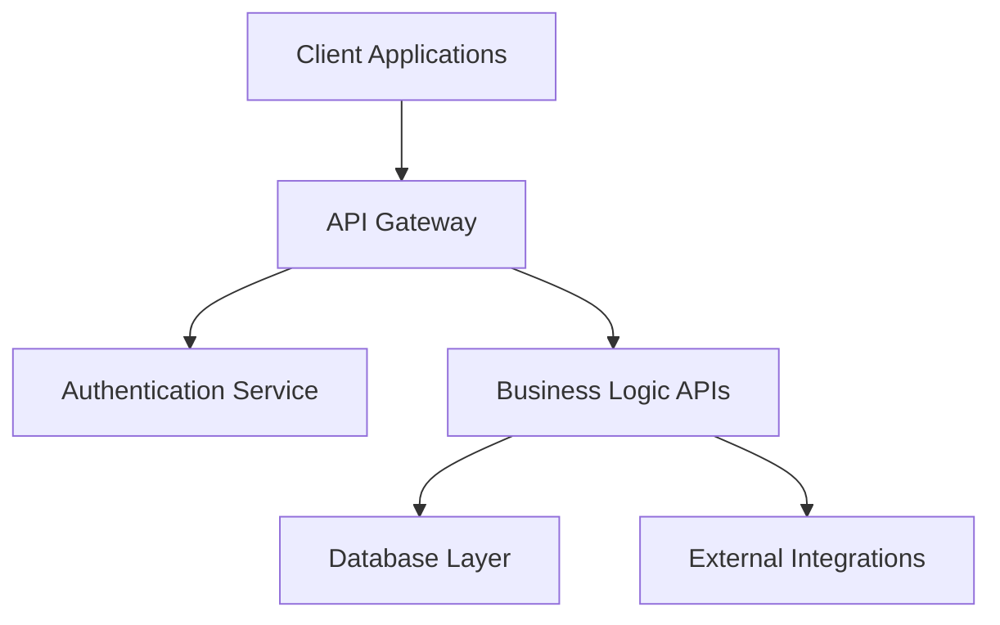

# API SPECIFICATIONS

# [PROJECT NAME]

<div align="center">


&nbsp;&nbsp;&nbsp;&nbsp;&nbsp;&nbsp;&nbsp;&nbsp;&nbsp;&nbsp;


**API Design & Integration Specifications**

</div>

---

## Document Information

| **Field** | **Details** |
|-----------|-------------|
| **Document Title** | API Specifications |
| **Project Name** | [PROJECT NAME] |
| **Client** | [CLIENT NAME] |
| **Prepared By** | 1CloudHub API Team |
| **Document Version** | v1.0 |
| **Date** | [CURRENT DATE] |
| **Document Type** | Technical Specifications |
| **Classification** | Confidential |

---

## Approval & Sign-off

| **Role** | **Name** | **Signature** | **Date** |
|----------|----------|---------------|----------|
| **API Architect** | [ARCHITECT NAME] | *Pending* | |
| **Technical Lead** | [TECH LEAD NAME] | *Pending* | |
| **Client Technical Lead** | [CLIENT TECH LEAD] | *Pending* | |
| **1CloudHub CRO** | Ramakrishna Phani | *Pending* | |

**Approval Status:**   
**GitHub Issue:** [Link to approval issue]  
**Sign-off Tracker:** [Link to tracker]

---

## Revision History

| **Version** | **Date** | **Author** | **Changes** | **Approved By** |
|-------------|----------|------------|-------------|-----------------|
| v1.0 | [DATE] | [AUTHOR] | Initial version | *Pending* |

---

## Table of Contents

1. [Introduction](#1-introduction)
2. [API Overview](#2-api-overview)
3. [Authentication & Security](#3-authentication--security)
4. [API Endpoints](#4-api-endpoints)
5. [Data Models](#5-data-models)
6. [Error Handling](#6-error-handling)
7. [Rate Limiting](#7-rate-limiting)
8. [Integration Guidelines](#8-integration-guidelines)
9. [Testing & Validation](#9-testing--validation)
10. [Monitoring & Logging](#10-monitoring--logging)
11. [Appendices](#11-appendices)

---

## 1. Introduction

### 1.1 Purpose

[Purpose of this API specification document]

### 1.2 Scope

[Scope of APIs covered in this document]

### 1.3 Audience

[Intended audience for this document]

### 1.4 API Design Principles

[Core principles followed in API design]

- **RESTful Design:** Following REST architectural principles
- **Consistency:** Consistent naming conventions and patterns
- **Security:** Built-in security and authentication
- **Scalability:** Designed for high performance and scale
- **Documentation:** Comprehensive and up-to-date documentation

---

## 2. API Overview

### 2.1 API Architecture

[High-level API architecture overview]



### 2.2 Base URL

```
Production: https://api.[CLIENT-DOMAIN].com/v1
Staging: https://api-staging.[CLIENT-DOMAIN].com/v1
Development: https://api-dev.[CLIENT-DOMAIN].com/v1
```

### 2.3 API Versioning

[API versioning strategy]

- **URL Versioning:** Version included in URL path (e.g., `/v1/`, `/v2/`)
- **Header Versioning:** Version specified in request headers
- **Backward Compatibility:** Maintaining compatibility across versions

### 2.4 Supported Formats

- **Request Format:** JSON
- **Response Format:** JSON
- **Character Encoding:** UTF-8
- **Date Format:** ISO 8601 (YYYY-MM-DDTHH:mm:ssZ)

---

## 3. Authentication & Security

### 3.1 Authentication Methods

#### 3.1.1 API Key Authentication

```http
GET /api/v1/resource
Authorization: Bearer {api_key}
```

#### 3.1.2 JWT Token Authentication

```http
GET /api/v1/resource
Authorization: Bearer {jwt_token}
```

#### 3.1.3 OAuth 2.0

[OAuth 2.0 implementation details]

### 3.2 Security Headers

[Required security headers]

```http
Content-Type: application/json
X-API-Version: v1
X-Request-ID: {unique_request_id}
Authorization: Bearer {token}
```

### 3.3 HTTPS Requirements

- All API calls must use HTTPS
- TLS 1.2 or higher required
- Certificate validation enforced

### 3.4 Request Signing

[If applicable, details on request signing]

---

## 4. API Endpoints

### 4.1 [Resource Group 1] APIs

#### 4.1.1 Get [Resource] List

**Endpoint:** `GET /api/v1/[resources]`

**Description:** [Description of what this endpoint does]

**Headers:**

```http
Authorization: Bearer {token}
Content-Type: application/json
```

**Query Parameters:**

| Parameter | Type | Required | Description | Default |
|-----------|------|----------|-------------|---------|
| page | integer | No | Page number for pagination | 1 |
| limit | integer | No | Number of items per page | 20 |
| filter | string | No | Filter criteria | none |
| sort | string | No | Sort field and direction | created_date:desc |

**Response:**

```json
{
  "success": true,
  "data": [
    {
      "id": "string",
      "name": "string",
      "created_date": "2025-06-04T10:30:00Z",
      "status": "active"
    }
  ],
  "pagination": {
    "page": 1,
    "limit": 20,
    "total": 100,
    "total_pages": 5
  }
}
```

**Status Codes:**

- `200 OK` - Success
- `400 Bad Request` - Invalid parameters
- `401 Unauthorized` - Authentication required
- `403 Forbidden` - Insufficient permissions
- `500 Internal Server Error` - Server error

#### 4.1.2 Get [Resource] by ID

**Endpoint:** `GET /api/v1/[resources]/{id}`

**Description:** [Description of what this endpoint does]

**Path Parameters:**

| Parameter | Type | Required | Description |
|-----------|------|----------|-------------|
| id | string | Yes | Unique identifier of the resource |

**Response:**

```json
{
  "success": true,
  "data": {
    "id": "string",
    "name": "string",
    "description": "string",
    "created_date": "2025-06-04T10:30:00Z",
    "updated_date": "2025-06-04T10:30:00Z",
    "status": "active"
  }
}
```

#### 4.1.3 Create [Resource]

**Endpoint:** `POST /api/v1/[resources]`

**Description:** [Description of what this endpoint does]

**Request Body:**

```json
{
  "name": "string",
  "description": "string",
  "category": "string"
}
```

**Response:**

```json
{
  "success": true,
  "data": {
    "id": "newly_created_id",
    "name": "string",
    "description": "string",
    "created_date": "2025-06-04T10:30:00Z",
    "status": "active"
  }
}
```

#### 4.1.4 Update [Resource]

**Endpoint:** `PUT /api/v1/[resources]/{id}`

**Description:** [Description of what this endpoint does]

**Request Body:**

```json
{
  "name": "string",
  "description": "string",
  "status": "active"
}
```

#### 4.1.5 Delete [Resource]

**Endpoint:** `DELETE /api/v1/[resources]/{id}`

**Description:** [Description of what this endpoint does]

**Response:**

```json
{
  "success": true,
  "message": "Resource deleted successfully"
}
```

### 4.2 [Resource Group 2] APIs

[Continue with additional resource groups...]

---

## 5. Data Models

### 5.1 [Model Name 1]

```json
{
  "id": {
    "type": "string",
    "description": "Unique identifier",
    "example": "usr_123456789"
  },
  "name": {
    "type": "string",
    "description": "Resource name",
    "required": true,
    "maxLength": 100
  },
  "email": {
    "type": "string",
    "format": "email",
    "description": "Email address",
    "required": true
  },
  "status": {
    "type": "string",
    "enum": ["active", "inactive", "pending"],
    "description": "Current status"
  },
  "created_date": {
    "type": "string",
    "format": "date-time",
    "description": "Creation timestamp"
  },
  "metadata": {
    "type": "object",
    "description": "Additional metadata"
  }
}
```

### 5.2 [Model Name 2]

[Continue with additional models...]

---

## 6. Error Handling

### 6.1 Error Response Format

```json
{
  "success": false,
  "error": {
    "code": "ERROR_CODE",
    "message": "Human readable error message",
    "details": [
      {
        "field": "field_name",
        "message": "Specific field error"
      }
    ],
    "request_id": "req_123456789"
  }
}
```

### 6.2 Standard Error Codes

| HTTP Status | Error Code | Description |
|-------------|------------|-------------|
| 400 | INVALID_REQUEST | Request validation failed |
| 401 | UNAUTHORIZED | Authentication required |
| 403 | FORBIDDEN | Insufficient permissions |
| 404 | NOT_FOUND | Resource not found |
| 409 | CONFLICT | Resource conflict |
| 422 | VALIDATION_FAILED | Data validation failed |
| 429 | RATE_LIMIT_EXCEEDED | Too many requests |
| 500 | INTERNAL_ERROR | Server error |
| 502 | BAD_GATEWAY | Upstream service error |
| 503 | SERVICE_UNAVAILABLE | Service temporarily unavailable |

### 6.3 Validation Errors

```json
{
  "success": false,
  "error": {
    "code": "VALIDATION_FAILED",
    "message": "Request validation failed",
    "details": [
      {
        "field": "email",
        "message": "Invalid email format"
      },
      {
        "field": "age",
        "message": "Must be greater than 0"
      }
    ]
  }
}
```

---

## 7. Rate Limiting

### 7.1 Rate Limit Policies

| User Type | Requests per Minute | Requests per Hour | Requests per Day |
|-----------|-------------------|------------------|------------------|
| **Public** | 60 | 1,000 | 10,000 |
| **Authenticated** | 300 | 10,000 | 100,000 |
| **Premium** | 1,000 | 50,000 | 500,000 |

### 7.2 Rate Limit Headers

```http
X-RateLimit-Limit: 1000
X-RateLimit-Remaining: 999
X-RateLimit-Reset: 1622548800
```

### 7.3 Rate Limit Exceeded Response

```json
{
  "success": false,
  "error": {
    "code": "RATE_LIMIT_EXCEEDED",
    "message": "Too many requests. Please try again later.",
    "retry_after": 60
  }
}
```

---

## 8. Integration Guidelines

### 8.1 Best Practices

#### 8.1.1 Request Best Practices

- Use appropriate HTTP methods (GET, POST, PUT, DELETE)
- Include request IDs for traceability
- Implement proper error handling
- Use pagination for large datasets
- Include relevant filters and sorting

#### 8.1.2 Response Handling

- Check HTTP status codes
- Parse JSON responses properly
- Handle rate limiting gracefully
- Implement retry logic with exponential backoff
- Log requests and responses for debugging

### 8.2 SDKs and Libraries

[Available SDKs and client libraries]

| Language | Library | Repository | Documentation |
|----------|---------|------------|---------------|
| JavaScript | [Library Name] | [GitHub URL] | [Docs URL] |
| Python | [Library Name] | [GitHub URL] | [Docs URL] |
| Java | [Library Name] | [GitHub URL] | [Docs URL] |

### 8.3 Sample Code

#### 8.3.1 JavaScript/Node.js Example

```javascript
const axios = require('axios');

const apiClient = axios.create({
  baseURL: 'https://api.example.com/v1',
  headers: {
    'Authorization': 'Bearer your_api_token',
    'Content-Type': 'application/json'
  }
});

// Get resource list
async function getResources() {
  try {
    const response = await apiClient.get('/resources');
    return response.data;
  } catch (error) {
    console.error('API Error:', error.response.data);
    throw error;
  }
}

// Create new resource
async function createResource(data) {
  try {
    const response = await apiClient.post('/resources', data);
    return response.data;
  } catch (error) {
    console.error('API Error:', error.response.data);
    throw error;
  }
}
```

#### 8.3.2 Python Example

```python
import requests
import json

class APIClient:
    def __init__(self, base_url, api_token):
        self.base_url = base_url
        self.headers = {
            'Authorization': f'Bearer {api_token}',
            'Content-Type': 'application/json'
        }
    
    def get_resources(self):
        response = requests.get(f'{self.base_url}/resources', headers=self.headers)
        response.raise_for_status()
        return response.json()
    
    def create_resource(self, data):
        response = requests.post(
            f'{self.base_url}/resources', 
            headers=self.headers,
            json=data
        )
        response.raise_for_status()
        return response.json()

# Usage
client = APIClient('https://api.example.com/v1', 'your_api_token')
resources = client.get_resources()
```

---

## 9. Testing & Validation

### 9.1 Testing Environments

| Environment | Base URL | Purpose |
|-------------|----------|---------|
| **Development** | <https://api-dev.example.com/v1> | Development testing |
| **Staging** | <https://api-staging.example.com/v1> | Pre-production testing |
| **Production** | <https://api.example.com/v1> | Live environment |

### 9.2 Postman Collection

[Link to Postman collection for API testing]

### 9.3 Test Scenarios

#### 9.3.1 Authentication Testing

- Valid token authentication
- Invalid token handling
- Expired token handling
- Missing token handling

#### 9.3.2 Functional Testing

- CRUD operations for each resource
- Data validation testing
- Error condition testing
- Edge case testing

#### 9.3.3 Performance Testing

- Load testing with concurrent requests
- Response time validation
- Rate limiting validation

---

## 10. Monitoring & Logging

### 10.1 API Metrics

[Key metrics tracked for API performance]

- Request count and rate
- Response time percentiles
- Error rates by endpoint
- Authentication success/failure rates

### 10.2 Logging Standards

[Logging format and requirements]

```json
{
  "timestamp": "2025-06-04T10:30:00Z",
  "request_id": "req_123456789",
  "method": "GET",
  "endpoint": "/api/v1/resources",
  "status_code": 200,
  "response_time_ms": 150,
  "user_id": "usr_123456789",
  "ip_address": "192.168.1.1"
}
```

### 10.3 Health Check Endpoint

**Endpoint:** `GET /api/v1/health`

**Response:**

```json
{
  "status": "healthy",
  "timestamp": "2025-06-04T10:30:00Z",
  "version": "1.0.0",
  "dependencies": {
    "database": "healthy",
    "external_service": "healthy"
  }
}
```

---

## 11. Appendices

### 11.1 OpenAPI Specification

[Link to OpenAPI/Swagger specification file]

### 11.2 Changelog

[API version changelog]

| Version | Date | Changes |
|---------|------|---------|
| v1.0 | [Date] | Initial API release |

### 11.3 Migration Guide

[Guidelines for migrating between API versions]

### 11.4 FAQ

[Frequently asked questions about the API]

### 11.5 Glossary

[API-related terms and definitions]

| Term | Definition |
|------|------------|
| [Term 1] | [Definition] |
| [Term 2] | [Definition] |

### 11.6 Contact Information

#### 11.6.1 1CloudHub API Team

- **API Architect:** [Name] - [email]
- **Technical Lead:** [Name] - [email]
- **Support Team:** <api-support@1cloudhub.com>

#### 11.6.2 Client Technical Team

- **Integration Lead:** [Name] - [email]
- **Technical Contact:** [Name] - [email]

---

**Document Classification:** Confidential  
**Distribution:** Limited to technical stakeholders  
**Next Review Date:** [Date + 30 days]  
**Document Owner:** 1CloudHub API Team

---

*This document contains confidential and proprietary information of 1CloudHub and [CLIENT NAME]. Any reproduction or distribution without written consent is prohibited.*
