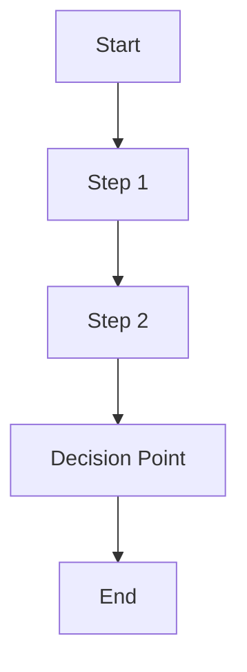

# BUSINESS REQUIREMENTS DOCUMENT

# [PROJECT NAME]

&nbsp;&nbsp;&nbsp;&nbsp;&nbsp;&nbsp;&nbsp;&nbsp;&nbsp;&nbsp;

**Strategic Partnership Project**

---

## Document Information

| **Field** | **Details** |
|-----------|-------------|
| **Document Title** | Business Requirements Document |
| **Project Name** | [PROJECT NAME] |
| **Client** | [CLIENT NAME] |
| **Prepared By** | 1CloudHub |
| **Document Version** | v1.0 |
| **Date** | [CURRENT DATE] |
| **Document Type** | Business Requirements |
| **Classification** | Confidential |

---

## Approval & Sign-off

| **Role** | **Name** | **Signature** | **Date** |
|----------|----------|---------------|----------|
| **Business Stakeholder** | [STAKEHOLDER NAME] | *Pending* | |
| **Technical Lead** | [TECH LEAD NAME] | *Pending* | |
| **Project Manager** | [PM NAME] | *Pending* | |
| **1CloudHub CRO** | Ramakrishna Phani | *Pending* | |

**Approval Status:**   
**GitHub Issue:** [Link to approval issue]  
**Sign-off Tracker:** [Link to tracker]

---

## Revision History

| **Version** | **Date** | **Author** | **Changes** | **Approved By** |
|-------------|----------|------------|-------------|-----------------|
| v1.0 | [DATE] | [AUTHOR] | Initial version | *Pending* |

---

## Table of Contents

1. [Executive Summary](#1-executive-summary)
2. [Project Background](#2-project-background)
3. [Business Objectives](#3-business-objectives)
4. [Stakeholder Analysis](#4-stakeholder-analysis)
5. [Current State Assessment](#5-current-state-assessment)
6. [Business Requirements](#6-business-requirements)
7. [Business Process Flows](#7-business-process-flows)
8. [Business Rules](#8-business-rules)
9. [Success Criteria](#9-success-criteria)
10. [Assumptions and Constraints](#10-assumptions-and-constraints)
11. [Risk Assessment](#11-risk-assessment)
12. [Implementation Timeline](#12-implementation-timeline)
13. [Appendices](#13-appendices)

---

## 1. Executive Summary

### 1.1 Project Overview

[Provide a high-level overview of the project, its strategic importance, and expected business impact]

### 1.2 Business Justification

[Explain why this project is necessary and how it aligns with business strategy]

### 1.3 Scope Summary

[Brief overview of what is included and excluded from the project scope]

### 1.4 Investment Summary

[High-level cost and resource requirements]

---

## 2. Project Background

### 2.1 Business Context

[Describe the business environment and context driving this project]

### 2.2 Problem Statement

[Clear articulation of the business problem being solved]

### 2.3 Opportunity Description

[Business opportunities this project will enable]

### 2.4 Strategic Alignment

[How this project aligns with organizational strategy and goals]

---

## 3. Business Objectives

### 3.1 Primary Objectives

[List the main business objectives this project aims to achieve]

1. **Objective 1:** [Description]
   - Success Metric: [Measurable outcome]
   - Target: [Specific target value]

2. **Objective 2:** [Description]
   - Success Metric: [Measurable outcome]
   - Target: [Specific target value]

### 3.2 Secondary Objectives

[Supporting objectives that add value]

### 3.3 Key Performance Indicators (KPIs)

[Specific metrics to measure project success]

| **KPI** | **Current State** | **Target State** | **Measurement Method** |
|---------|-------------------|------------------|------------------------|
| [KPI 1] | [Current Value] | [Target Value] | [How to measure] |
| [KPI 2] | [Current Value] | [Target Value] | [How to measure] |

---

## 4. Stakeholder Analysis

### 4.1 Primary Stakeholders

[Key decision makers and primary users]

| **Stakeholder** | **Role** | **Responsibilities** | **Contact** |
|-----------------|----------|---------------------|-------------|
| [Name] | [Title] | [Key responsibilities] | [Email] |

### 4.2 Secondary Stakeholders

[Additional stakeholders affected by the project]

### 4.3 Stakeholder Impact Analysis

[How different stakeholders will be affected by the project]

---

## 5. Current State Assessment

### 5.1 Current Business Processes

[Description of how business processes currently work]

### 5.2 Current System Landscape

[Overview of existing systems and technologies]

### 5.3 Pain Points and Challenges

[Current problems and inefficiencies]

1. **Challenge 1:** [Description]
   - Impact: [Business impact]
   - Frequency: [How often this occurs]

2. **Challenge 2:** [Description]
   - Impact: [Business impact]
   - Frequency: [How often this occurs]

### 5.4 Current Performance Metrics

[Baseline measurements for comparison]

---

## 6. Business Requirements

### 6.1 Functional Requirements

#### 6.1.1 [Business Function 1]

[Description of business function]

| **Requirement ID** | **Requirement Description** | **Priority** | **Acceptance Criteria** |
|-------------------|----------------------------|--------------|-------------------------|
| BR-001 | [Requirement description] | Must Have | [Specific acceptance criteria] |
| BR-002 | [Requirement description] | Should Have | [Specific acceptance criteria] |

#### 6.1.2 [Business Function 2]

[Description of business function]

| **Requirement ID** | **Requirement Description** | **Priority** | **Acceptance Criteria** |
|-------------------|----------------------------|--------------|-------------------------|
| BR-003 | [Requirement description] | Must Have | [Specific acceptance criteria] |

### 6.2 Non-Functional Requirements

#### 6.2.1 Performance Requirements

[Business performance expectations]

#### 6.2.2 Usability Requirements

[User experience and usability needs]

#### 6.2.3 Compliance Requirements

[Regulatory and compliance requirements]

---

## 7. Business Process Flows

### 7.1 Future State Process Flows

[Description of how business processes will work in the future state]

#### 7.1.1 [Process Name 1]

#### 7.1.2 [Process Name 2]

[Process description and flow diagram]

### 7.2 Process Improvement Opportunities

[How the new processes improve upon current state]

---

## 8. Business Rules

### 8.1 Core Business Rules

[Fundamental business rules that must be enforced]

1. **Rule 1:** [Description]
   - Condition: [When this rule applies]
   - Action: [What happens when rule is triggered]

2. **Rule 2:** [Description]
   - Condition: [When this rule applies]
   - Action: [What happens when rule is triggered]

### 8.2 Validation Rules

[Data validation and business logic rules]

### 8.3 Authorization Rules

[Access control and authorization requirements]

---

## 9. Success Criteria

### 9.1 Business Success Metrics

[How business success will be measured]

| **Metric** | **Current Baseline** | **Target** | **Timeline** |
|------------|---------------------|------------|--------------|
| [Metric 1] | [Current value] | [Target value] | [When to achieve] |
| [Metric 2] | [Current value] | [Target value] | [When to achieve] |

### 9.2 User Adoption Criteria

[Expected user adoption and engagement levels]

### 9.3 Operational Excellence Criteria

[Operational performance expectations]

---

## 10. Assumptions and Constraints

### 10.1 Business Assumptions

[Key assumptions about business environment and requirements]

1. **Assumption 1:** [Description]
   - Impact if invalid: [Potential impact]
   - Validation approach: [How to validate]

### 10.2 Constraints

[Limitations and restrictions that affect the project]

#### 10.2.1 Budget Constraints

[Financial limitations]

#### 10.2.2 Timeline Constraints

[Schedule limitations]

#### 10.2.3 Resource Constraints

[People and skill limitations]

#### 10.2.4 Technical Constraints

[Technology and system limitations]

---

## 11. Risk Assessment

### 11.1 Business Risks

[Risks that could impact business objectives]

| **Risk ID** | **Risk Description** | **Probability** | **Impact** | **Mitigation Strategy** |
|-------------|---------------------|-----------------|------------|-------------------------|
| BR-R001 | [Risk description] | [High/Med/Low] | [High/Med/Low] | [Mitigation approach] |
| BR-R002 | [Risk description] | [High/Med/Low] | [High/Med/Low] | [Mitigation approach] |

### 11.2 Dependency Risks

[Risks related to external dependencies]

### 11.3 Change Management Risks

[Risks related to organizational change]

---

## 12. Implementation Timeline

### 12.1 High-Level Milestones

[Key business milestones and timelines]

| **Milestone** | **Description** | **Target Date** | **Dependencies** |
|---------------|-----------------|-----------------|------------------|
| [Milestone 1] | [Description] | [Date] | [Dependencies] |
| [Milestone 2] | [Description] | [Date] | [Dependencies] |

### 12.2 Critical Path Items

[Most important timeline dependencies]

### 12.3 Go-Live Criteria

[What needs to be true for business go-live]

---

## 13. Appendices

### 13.1 Glossary

[Business terms and definitions]

| **Term** | **Definition** |
|----------|----------------|
| [Term 1] | [Definition] |
| [Term 2] | [Definition] |

### 13.2 Reference Documents

[Supporting documentation and references]

1. [Document Name] - [Brief description]
2. [Document Name] - [Brief description]

### 13.3 Stakeholder Interview Notes

[Summary of key stakeholder discussions]

### 13.4 Market Research Data

[Relevant market research and competitive analysis]

---

## Contact Information

### 1CloudHub Team

- **CRO:** Ramakrishna Phani - [email]
- **Project Manager:** [Name] - [email]
- **Business Analyst:** [Name] - [email]

### Client Team

- **Business Stakeholder:** [Name] - [email]
- **Project Sponsor:** [Name] - [email]
- **Business Users:** [Names and contacts]

---

**Document Classification:** Confidential  
**Distribution:** Limited to project stakeholders  
**Next Review Date:** [Date + 30 days]  
**Document Owner:** 1CloudHub Business Analysis Team

---

*This document contains confidential and proprietary information of 1CloudHub and [CLIENT NAME]. Any reproduction or distribution without written consent is prohibited.*
