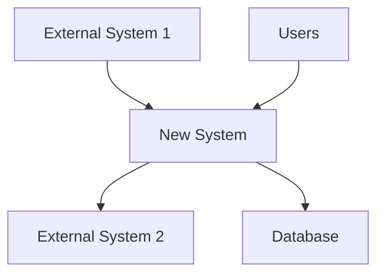
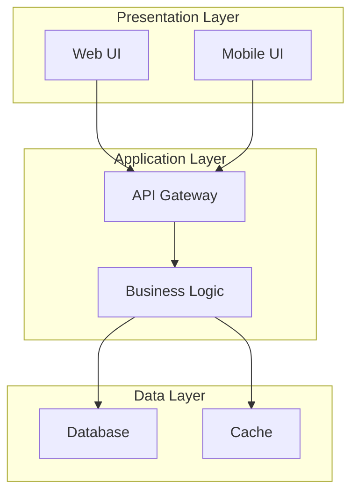

# SOFTWARE REQUIREMENTS SPECIFICATION

# [PROJECT NAME]

&nbsp;&nbsp;&nbsp;&nbsp;&nbsp;&nbsp;&nbsp;&nbsp;&nbsp;&nbsp;

**Technical Requirements Documentation**

---

## Document Information

| **Field** | **Details** |
|-----------|-------------|
| **Document Title** | Software Requirements Specification |
| **Project Name** | [PROJECT NAME] |
| **Client** | [CLIENT NAME] |
| **Prepared By** | 1CloudHub Technical Team |
| **Document Version** | v1.0 |
| **Date** | [CURRENT DATE] |
| **Document Type** | Technical Requirements |
| **Classification** | Confidential |

---

## Approval & Sign-off

| **Role** | **Name** | **Signature** | **Date** |
|----------|----------|---------------|----------|
| **Technical Lead** | [TECH LEAD NAME] | *Pending* | |
| **Architecture Lead** | [ARCHITECT NAME] | *Pending* | |
| **Client Technical Lead** | [CLIENT TECH LEAD] | *Pending* | |
| **1CloudHub CRO** | Ramakrishna Phani | *Pending* | |

**Approval Status:**   
**GitHub Issue:** [Link to approval issue]  
**Sign-off Tracker:** [Link to tracker]

---

## Revision History

| **Version** | **Date** | **Author** | **Changes** | **Approved By** |
|-------------|----------|------------|-------------|-----------------|
| v1.0 | [DATE] | [AUTHOR] | Initial version | *Pending* |

---

## Table of Contents

1. [Introduction](#1-introduction)
2. [Overall Description](#2-overall-description)
3. [System Architecture](#3-system-architecture)
4. [Functional Requirements](#4-functional-requirements)
5. [Non-Functional Requirements](#5-non-functional-requirements)
6. [System Interfaces](#6-system-interfaces)
7. [Data Requirements](#7-data-requirements)
8. [Security Requirements](#8-security-requirements)
9. [Implementation Constraints](#9-implementation-constraints)
10. [Acceptance Criteria](#10-acceptance-criteria)
11. [Appendices](#11-appendices)

---

## 1. Introduction

### 1.1 Purpose

[Explain the purpose of this SRS document and its intended audience]

### 1.2 Scope

[Define the scope of the software system being specified]

### 1.3 Definitions, Acronyms, and Abbreviations

| **Term/Acronym** | **Definition** |
|------------------|----------------|
| [Term 1] | [Definition] |
| [Term 2] | [Definition] |

### 1.4 References

[List all documents referenced in this SRS]

1. [Business Requirements Document] - v[X.X]
2. [Technical Architecture Document] - v[X.X]

### 1.5 Overview

[Brief overview of the remainder of the SRS document]

---

## 2. Overall Description

### 2.1 Product Perspective

[Describe how the software system fits into the larger system landscape]

#### 2.1.1 System Context Diagram

#### 2.1.2 System Interfaces

[High-level description of system interfaces]

### 2.2 Product Functions

[High-level summary of major functions the software will perform]

### 2.3 User Classes and Characteristics

[Description of different types of users]

| **User Class** | **Description** | **Technical Expertise** | **Frequency of Use** |
|----------------|-----------------|-------------------------|----------------------|
| [User Type 1] | [Description] | [High/Medium/Low] | [Daily/Weekly/Monthly] |
| [User Type 2] | [Description] | [High/Medium/Low] | [Daily/Weekly/Monthly] |

### 2.4 Operating Environment

[Description of the environment in which the software will operate]

#### 2.4.1 Hardware Platform

[Hardware requirements and constraints]

#### 2.4.2 Software Platform

[Software platform requirements]

#### 2.4.3 Network Environment

[Network and connectivity requirements]

### 2.5 Design and Implementation Constraints

[Factors that restrict design choices]

### 2.6 User Documentation

[Documentation that will be delivered with the software]

### 2.7 Assumptions and Dependencies

[Factors that affect the requirements]

---

## 3. System Architecture

### 3.1 High-Level Architecture

[Overall system architecture description]

#### 3.1.1 Architecture Diagram

### 3.2 Technology Stack

[Detailed technology stack specification]

| **Layer** | **Technology** | **Version** | **Purpose** |
|-----------|----------------|-------------|-------------|
| Frontend | [Technology] | [Version] | [Purpose] |
| Backend | [Technology] | [Version] | [Purpose] |
| Database | [Technology] | [Version] | [Purpose] |
| Infrastructure | [Technology] | [Version] | [Purpose] |

### 3.3 Deployment Architecture

[How the system will be deployed and configured]

---

## 4. Functional Requirements

### 4.1 [Module/Component 1]

#### 4.1.1 Description

[Overview of this module's functionality]

#### 4.1.2 Functional Requirements

| **Requirement ID** | **Requirement Description** | **Priority** | **Complexity** |
|-------------------|----------------------------|--------------|----------------|
| FR-[Module]-001 | [Detailed functional requirement] | Must Have | High |
| FR-[Module]-002 | [Detailed functional requirement] | Should Have | Medium |
| FR-[Module]-003 | [Detailed functional requirement] | Could Have | Low |

#### 4.1.3 Input/Output Specifications

[Detailed input and output specifications]

#### 4.1.4 Processing Rules

[Business logic and processing rules]

### 4.2 [Module/Component 2]

#### 4.2.1 Description

[Overview of this module's functionality]

#### 4.2.2 Functional Requirements

[Continue with same format as 4.1.2]

---

## 5. Non-Functional Requirements

### 5.1 Performance Requirements

| **Requirement ID** | **Requirement Description** | **Target Metric** | **Priority** |
|-------------------|----------------------------|-------------------|--------------|
| NFR-PERF-001 | [Performance requirement] | [Specific metric] | Must Have |
| NFR-PERF-002 | [Performance requirement] | [Specific metric] | Should Have |

### 5.2 Security Requirements

| **Requirement ID** | **Requirement Description** | **Implementation** | **Priority** |
|-------------------|----------------------------|-------------------|--------------|
| NFR-SEC-001 | [Security requirement] | [How to implement] | Must Have |
| NFR-SEC-002 | [Security requirement] | [How to implement] | Must Have |

### 5.3 Reliability Requirements

| **Requirement ID** | **Requirement Description** | **Target Metric** | **Priority** |
|-------------------|----------------------------|-------------------|--------------|
| NFR-REL-001 | [Reliability requirement] | [Specific metric] | Must Have |
| NFR-REL-002 | [Reliability requirement] | [Specific metric] | Should Have |

### 5.4 Usability Requirements

| **Requirement ID** | **Requirement Description** | **Success Criteria** | **Priority** |
|-------------------|----------------------------|---------------------|--------------|
| NFR-USA-001 | [Usability requirement] | [How to measure] | Should Have |
| NFR-USA-002 | [Usability requirement] | [How to measure] | Could Have |

### 5.5 Scalability Requirements

| **Requirement ID** | **Requirement Description** | **Target Metric** | **Priority** |
|-------------------|----------------------------|-------------------|--------------|
| NFR-SCAL-001 | [Scalability requirement] | [Specific metric] | Must Have |
| NFR-SCAL-002 | [Scalability requirement] | [Specific metric] | Should Have |

### 5.6 Maintainability Requirements

| **Requirement ID** | **Requirement Description** | **Implementation** | **Priority** |
|-------------------|----------------------------|-------------------|--------------|
| NFR-MAIN-001 | [Maintainability requirement] | [How to implement] | Should Have |

---

## 6. System Interfaces

### 6.1 User Interfaces

#### 6.1.1 General UI Requirements

[Overall user interface requirements]

#### 6.1.2 Specific UI Requirements

[Detailed UI requirements for each major interface]

### 6.2 Hardware Interfaces

[Description of hardware interfaces if any]

### 6.3 Software Interfaces

#### 6.3.1 External System Interfaces

[Interfaces with external systems]

| **System** | **Interface Type** | **Data Format** | **Frequency** | **Authentication** |
|------------|-------------------|-----------------|---------------|-------------------|
| [System 1] | [REST API/File/etc] | [JSON/XML/etc] | [Real-time/Batch] | [Auth method] |
| [System 2] | [REST API/File/etc] | [JSON/XML/etc] | [Real-time/Batch] | [Auth method] |

#### 6.3.2 Internal Component Interfaces

[Interfaces between internal components]

### 6.4 Communication Interfaces

[Network protocols and communication requirements]

---

## 7. Data Requirements

### 7.1 Data Models

#### 7.1.1 Conceptual Data Model

[High-level data model showing main entities and relationships]

#### 7.1.2 Logical Data Model

[Detailed data model with attributes and relationships]

### 7.2 Data Dictionary

| **Entity** | **Attribute** | **Data Type** | **Length** | **Required** | **Description** |
|------------|---------------|---------------|------------|--------------|-----------------|
| [Entity 1] | [Attribute 1] | [Type] | [Length] | [Y/N] | [Description] |
| [Entity 1] | [Attribute 2] | [Type] | [Length] | [Y/N] | [Description] |

### 7.3 Data Storage Requirements

[Database requirements, backup, archival policies]

### 7.4 Data Migration Requirements

[Requirements for migrating existing data]

---

## 8. Security Requirements

### 8.1 Authentication Requirements

[User authentication and identity management]

### 8.2 Authorization Requirements

[Access control and permissions]

### 8.3 Data Protection Requirements

[Data encryption, privacy, and protection]

### 8.4 Audit and Logging Requirements

[Security monitoring and audit trail requirements]

### 8.5 Compliance Requirements

[Regulatory and compliance requirements]

---

## 9. Implementation Constraints

### 9.1 Technical Constraints

[Technology limitations and restrictions]

### 9.2 Business Constraints

[Business rules and policy constraints]

### 9.3 Regulatory Constraints

[Legal and regulatory requirements]

### 9.4 Resource Constraints

[Budget, timeline, and resource limitations]

---

## 10. Acceptance Criteria

### 10.1 Functional Acceptance Criteria

[Criteria for accepting functional requirements]

| **Requirement ID** | **Acceptance Criteria** | **Test Method** |
|-------------------|------------------------|-----------------|
| FR-001 | [Specific acceptance criteria] | [How to test] |
| FR-002 | [Specific acceptance criteria] | [How to test] |

### 10.2 Non-Functional Acceptance Criteria

[Criteria for accepting non-functional requirements]

### 10.3 User Acceptance Criteria

[Criteria for user acceptance testing]

---

## 11. Appendices

### 11.1 Requirements Traceability Matrix

[Mapping between business requirements and functional requirements]

| **Business Req** | **Functional Req** | **Test Case** | **Status** |
|------------------|-------------------|---------------|------------|
| BR-001 | FR-001, FR-002 | TC-001, TC-002 | Defined |
| BR-002 | FR-003 | TC-003 | Defined |

### 11.2 Glossary

[Technical terms and definitions]

### 11.3 Assumptions Register

[Detailed list of all assumptions]

### 11.4 Risk Register

[Technical risks and mitigation strategies]

### 11.5 Open Issues

[Unresolved questions and issues]

| **Issue ID** | **Description** | **Priority** | **Owner** | **Target Resolution** |
|--------------|-----------------|--------------|-----------|----------------------|
| ISS-001 | [Issue description] | [High/Med/Low] | [Owner] | [Date] |

---

## Contact Information

### 1CloudHub Technical Team

- **Technical Lead:** [Name] - [email]
- **Solution Architect:** [Name] - [email]
- **Development Lead:** [Name] - [email]

### Client Technical Team

- **Technical Stakeholder:** [Name] - [email]
- **System Administrator:** [Name] - [email]

---

**Document Classification:** Confidential  
**Distribution:** Limited to technical stakeholders  
**Next Review Date:** [Date + 30 days]  
**Document Owner:** 1CloudHub Technical Team

---

*This document contains confidential and proprietary information of 1CloudHub and [CLIENT NAME]. Any reproduction or distribution without written consent is prohibited.*
